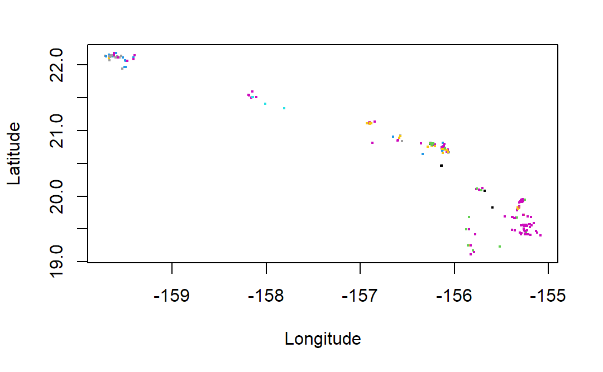
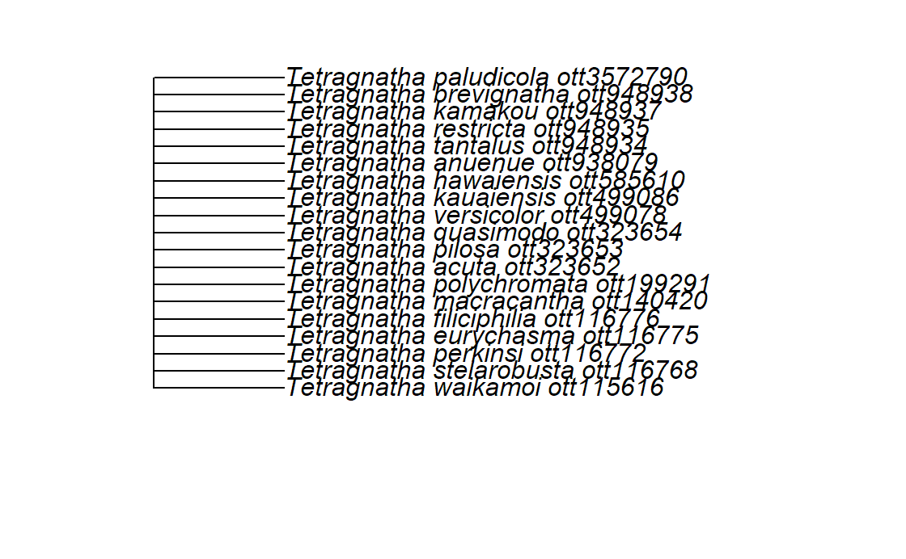

```{r setup, include=FALSE}
knitr::opts_chunk$set(echo = TRUE,  results = TRUE, eval = FALSE)
```

::: questions
-   Where do multi-dimensional biodiversity data
    live online?
-   How can we use R APIs to quickly and
    reproducibly retrieve data?
-   What about data that's not in a database?
:::

::: objectives
After following this episode, we intend that
participants will be able to:

1.  Effectively search for and find occurrence,
    phylogenetic, sequence, and trait data online
    given a taxon or research question
2.  Retrieve data from NCBI & GBIF using their R
    APIs and apply API principles to other
    databases
:::

# Sources of multidimensional biodiversity data: large open-access databases

Large open-access biological databases have been
growing at an incredible pace in recent years.
Often they accumulate data from many projects and
organizations. These platforms are then used to
share and standardize data for wide use.

Many such databases exist, but here are some
listed examples:

-   [GBIF](https://www.gbif.org/) contains
    occurrence records of individuals assembled
    from dozens of smaller databases.

-   [NCBI](https://www.ncbi.nlm.nih.gov/)
    (National Center for Biotechnology
    Information) database, which includes
    [GenBank](https://www.ncbi.nlm.nih.gov/genbank/)
    is the largest repository of genetic data in
    the world, but includes a lot of biomedical
    data.

-   [OTOL](https://tree.opentreeoflife.org/opentree/argus/opentree14.7@ott93302)
    (Open Tree of Life) is a database that
    combines numerous published trees and
    taxonomies into one supertree

-   [GEOME](https://geome-db.org/) (Genomic
    Observatories MetaDatabase) contains genetic
    data associated with specimens or samples from
    the field.

-   [BOLD](https://boldsystems.org/) (Barcode of
    Life) is a reference library and database for
    DNA barcoding

-   [EOL](https://eol.org/) (Encyclopedia of Life)
    is a species-level platform containing data
    like taxonomic descriptions, distribution
    maps, and images

:::: discussion

Do you have a favorite database? It doesn't have to be in the list!
Why do you like it, or how does it fit your research? 

::::

## What's an API?

An API is a set of tools that allows users to
interact with a database, such as reading,
writing, updating, and deleting data. We can't go
over all of these databases in detail, but let's
cover some examples that illustrate some
principles of how these APIs work for different
types of biodiversity data.

We can do this using the example of Hawaiian
arthropods. Hawaii is known for its diversity of
*Tetragnatha*, a genus of orb weaver spiders. With
this target in mind let's download some
*occurrence* data from GBIF, some *sequence* data
from NCBI, and a *phylogeny* for *Tetragnatha*
spiders from OTOL.

### Using APIs: Setup

For this episode, we'll be working with some R
packages that wrap the APIs of online
repositories. Let's set those up now.

```{r pkg-setup}
library(spocc)
library(rentrez)
library(rotl) 
library(taxize)
library(dplyr)
```

### Getting consistent species names using `taxize`

We will want to source records of the genus
*Tetragnatha*, but some APIs will require species
names rather than the names of broader taxa like
genus or family. We can use the `taxize` package
for this. `taxize` links to a genus identification
number, drawn from NCBI, for each genus. We use
the `get_uid()` function to get this number:

```{r}
uid <- get_uid("Tetragnatha")
```

::: instructor
You will be prompted to get an ENTREZ API key.
This is a good idea to do in order to make larger
queries, but it won't be necessary for this
workshop.
:::

Then, we use the `downstream()` function to get a
list of all species in *Tetragnatha*.

::: callout
This also works on larger taxa like families and
orders.
:::

```{r}
species_uids <- downstream(uid,downto="species")
species_names <- species_uids[[1]]$childtaxa_name

head(species_names)
```

### Occurrence data from GBIF

The `spocc` package is all about occurrence data
and lets you download occurrences from all major
occurrence databases. For GBIF access using the
spocc package, we use the `occ()` function.

We'll put the species names we retrieved as the
`query` and specify `gbif` as our target database
in the `from` field.

Since the occurrences from spocc are organized as
a list of dataframes, one per species, we use the
`bind_rows()` function from `dplyr` to combine this
into a single dataframe.

We can also specify a geographic bounding box of
where we'd like to look for occurrences. Here we're
using a bounding box that covers the Hawaiian
Islands.

```{r}
occurrences <- occ(query = species_names, from = 'gbif', has_coords=TRUE, 
                   gbifopts=list("decimalLatitude"='18.910361,28.402123',
                                 "decimalLongitude"='-178.334698,-154.806773')) 

# extract the data from gbif
occurrences_gbif <- occurrences$gbif$data 

# the results in `$data` are a list with one element per species, 
# so we combine all those elements
occurrences_df <- bind_rows(occurrences_gbif)

# plot coordinates of occurrences colored by species
plot(occurrences_df$longitude,occurrences_df$latitude,
     cex=0.25,ylab="Latitude",xlab="Longitude",
     col=as.factor(occurrences_df$species))

```



::: challenge

How was the abundance data returned to us from the occ() function organized?

::: solution

The occ() function returned an object of class occDat.
It contains members for each database you could have queried, like "gbif" or "ebird". 
Each of these members contains members called "data" which holds the actual data, and "meta" which contains metadata on what we searched for and how it was returned. 
The "data" object is a list where each member of the list holds a dataframe of records for a different species. 
As described we can use "bind_rows" from dplyr to create a composite dataframe from this list. 

:::

:::

### But wait, what is occurrence data? 

Occurrence is related to abundance in that it also
describes how species are distributed in space but
is different in some important ways.

A single abundance data point describes the amount
of individuals of a species in a certain area.

But a single occurrence data point describes the
presence of a SINGLE individual in a location.

Occurrence data is vastly more common than
abundance data online, but often comes with much
greater bias in the way it captures the
distribution of biodiversity. It is often
"incidental". A citizen scientist happening to
record a new butterfly they saw on their morning
hike (occurrence) or a researcher electing to
record a rare beetle they were looking for
(occurrence) are much less systematic and more
biased than the field surveys specifically
intended to monitor abundance.

Due to this bias it is often used just to indicate
presence-absence of a species rather than the
magnitude of its population size.

It can be possible to obtain "abundance-like"
information from occurrences, but it requires VERY
careful consideration of bias and uncertainty.

:::: discussion

Have you used occurrence data in your work?
What do you think are some pros and cons?

::::

### Phylogenetic trees from the Open Tree of Life

First we'll get a clean list of taxonomic
names from the GBIF results. We could use our initial names we got from `taxize`, but using our GBIF results conveniently narrows things down to Hawaii species only. 

```{r}
species_names_hawaii <- unique(occurrences_df$name)
species_names_resolved <- gnr_resolve(species_names_hawaii, best_match_only = TRUE, 
                          canonical = TRUE)
species_names_hawaii <- species_names_resolved$matched_name2
```

Now we can use the `rotl` package. The `rotl`
package provides an interface to the Open Tree of
Life. To get a tree from this database, we have to
match our species names to OTOL's ids.

We first use `trns_match_names()` to match our
species names to OTOL's taxonomy.

Then we use `ott_id()` to get OTOL ids for these
matched names.

```{r}
species_names_otol <- tnrs_match_names(species_names_hawaii)
otol_ids <- ott_id(species_names_otol)
```

Finally, we get the tree containing these IDs as
tips.

```{r}
tr <- tol_induced_subtree(ott_ids = otol_ids)
plot(tr)
```



Unfortunately we can see that the phylogenetic
relationships between these species aren't
resolved in OTOL, so we may have to look elsewhere
for a phylogeny. This is an example of how not all
the data we are looking for are in large
repositories, especially higher resolution
phylogenies.

### Sequence data from NCBI

Let's continue with the `rentrez` package, which
provides an interface to NCBI. The two usual steps for querying from NCBI is an ID search using entrez_search() and a records fetch using those IDs in entrez_fetch(). Sound a bit familiar? 

We'll again search for the species in our Hawaii occurrences. 

The main arguments of the entrez_search() function are "db", the database to look in, and "term" a string representing the whole query. While the occ() function had multiple fields for different ways we are narrowing our search, the "term" field wraps this up in a single string.

```{r}
# we're using `species_names` that we made previously to make a long
# string of names that will be sent to NCBI via the ENTREZ API
termstring <- paste(sprintf('%s[ORGN]', species_names_hawaii), collapse = ' OR ')

search_results <- entrez_search(db="nucleotide", term = termstring)

# take a quick look at all the possible things we could have added to term for this database - it includes [GENE] for looking for specific genes or [SLEN] for length of sequence
entrez_db_searchable(db="nucleotide")

```
::: callout
It is also possible to query for ranks higher than species in entrez_search() also using the [ORGN] tag i.e. Tetragnatha[ORGN]
:::

*Unlike* `spocc` but *similarly* to `rotl`, this
first search returns a set of IDs.

We then have to use `entrez_fetch()` on the IDs in
search_results to obtain the actual record
information.

We specify 'db' as 'nucleotide' and 'rettype' as
'fasta' to get FASTA sequences

```{r}

sequences <- entrez_fetch(db = "nucleotide", id = search_results$ids, 
                          rettype = "fasta")

# just look at the first part of this *long* returned string
# substr gets characters 1 through 1148 of the FASTA, and cat simply prints it with line breaks
cat(substr(sequences,1,1148))
```

::: challenge
What are some similarities and differences in how
data is queried using the R APIs of GBIF, NCBI,
and OTOL?
:::

::: solution
NCBI and OTOL both require an initial search to
obtain record IDs, then a second fetch to obtain
the actual record data for each ID

NCBI uses a string-based query where the search is
a specially-formated string, while GBIF uses an
argument-based query where the search is based on
the various arguments you give to the R function. 

NCBI is capable of taking a genus and returning
the records of all its species, but OTOL and GBIF
require obtaining the species names first using a
package like taxize

GBIF data is formatted as a list of occurrences
for each species contained in the object we get
from the query.
:::

# Sources of MDBD: Databases without APIs

Many excellent databases exist without specialized
APIs or R packages to facilitate their use.

For example, the BioTIME database is a compilation
of timeseries of species ocurrence, abundance, and
biomass data. It is [openly
available](https://biotime.st-andrews.ac.uk/) via
the University of St. Andrews. The North American
Breeding Bird Survey, run by the USGS, contains
data on bird species abundances across the United
States and Canada going back more than 50 years.
These data are hosted on
[ScienceBase](https://www.sciencebase.gov/catalog/item/52b1dfa8e4b0d9b325230cd9).

Some of these databases can be accessed via the
[Data Retriever and accompanying R package the
`rdataretriever`.](https://retriever.readthedocs.io/en/latest/)

Some are findable via
[DataONE](https://search.dataone.org/data) and the
[Ecological Data
Initiative](https://edirepository.org/).

Others can be downloaded directly from the source.

# Sources of MDBD: "small data" attached to papers

Finally, A lot of useful data is not held in
databases, and is instead attached to papers.
Searching manuscript databases or Google Scholar
can be an effective way to find such data. You can
filter Web of Science to find entries with
"associated data".

However, this can still be a somewhat
heterogeneous and time-consuming strategy!

::: instructor
Time-permitting, this could be an opportunity for
a 15-minute breakout exercise where individuals or
groups pick a database or website and search for
data, then report back on what they found and what
the process was like.
:::

:::: discussion

For a taxon and datatype of your choice, find a database online that we didn't go over and doesn't have an R API. Download some data from it. How did you query for your data? What is the structure of the data you downloaded? Discuss and contrast with folks at your table if applicable!

::::

# Recap

::: keypoints
-   Many sources exist online where
    multidimensional biodiversity data can be
    obtained
-   APIs allow for fast and reproducible querying
    and downloading
-   While there are patterns in how these APIs
    work, there will always be differences between
    databases that make using each API a bit
    different.
-   Standalone databases and even the supplemental
    data in manuscripts can also be re-used.
:::
