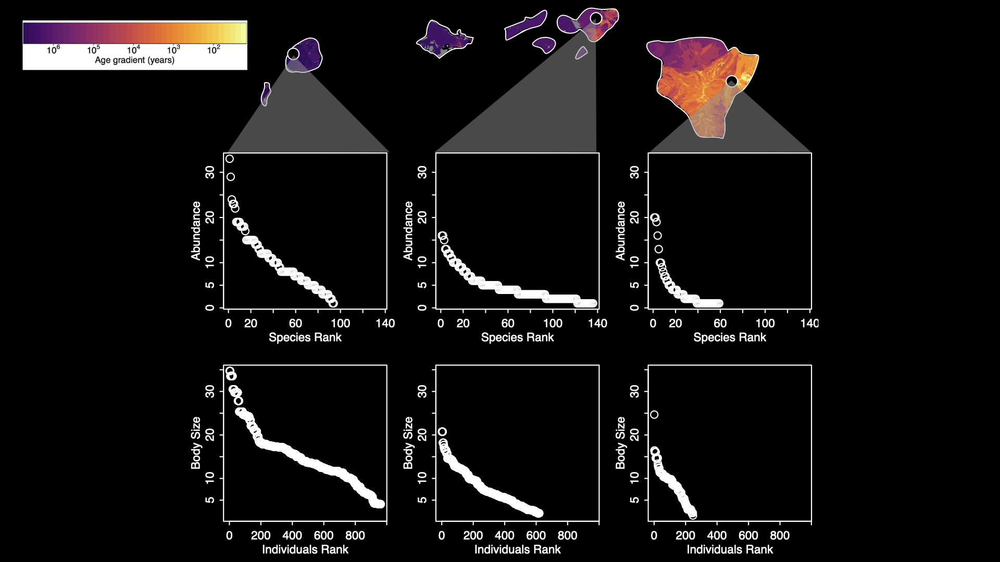

:::::::::::::::::::::::::::::::::::::: questions 

1. What do we mean by "multidimensional biodiversity data?
1. What are the four types of data we'll be covering in this workshop?
1. What types of questions can we explore with these data?
1. How will this workshop be structured? Where do I find course materials, etc?

::::::::::::::::::::::::::::::::::::::::::::::::

::::::::::::::::::::::::::::::::::::: objectives

After following this episode, participants should be able to...

1. Articulate a shared understanding of what "multidimensional biodiversity data" is
1. List the types of data to be covered in this workshop, and potential applications of MBDB
1. Locate course resources.

::::::::::::::::::::::::::::::::::::::::::::::::

## Welcome

::: instructor

Given that this curriculum deals explicitly with Indigenous data sovereignty and governance, it is advisable to start with a land acknowledgement. 

For Albuquerque, NM (the location of the first offering of this curriculum) here is info UNM's land acknowledgement and the process leading up to it:
- https://diverse.unm.edu/about-dei-at-unm/land-labor-acknowledgement.html
- https://diverse.unm.edu/assets/documents/unm-indigenous-peoples-land-and-territory-acknowledgment-brown-paper.pdf

Any land acknowledgement should be done in the context of growing awareness that the intentions of many land acknowledgements, while aspiring to be good intentions, where ill-informed and the acknowledgements have led to harm in some cases.  Here are resources to read about that:
- https://nativegov.org/news/beyond-land-acknowledgment-guide/
- https://hyperallergic.com/769024/your-land-acknowledgment-is-not-enough/
- https://www.pbs.org/newshour/nation/analysis-how-well-meaning-land-acknowledgements-can-erase-indigenous-people-and-sanitize-history

It is becoming agreed upon protocol that land acknowledgements should be given only in the context of how the event or institution presenting the land acknowledgement engages with activities beyond an otherwise hollow "acknowledgement" of unceded lands.  

:::

Welcome everyone!  This workshop will engage with ethics around biodiversity data through the lens of Indigenous data sovereignty and governance.  With that in mind, many of the locations where this workshop might run will likely be unceded Indigenous lands.  As part of our introductions we'll think about where we are, where we come from, and our positionalities.  [Native Land Digital](https://native-land.ca/) is a great resource for understanding where we are geographically, and here is a great video by Dr. Kat Gardner-Vandy and Daniella Scalice demonstrating classical academic introductions and relational introductions that center positionality:

<iframe src="https://www.youtube.com/embed/sY3LYVTTiH4?start=414&end=811" data-external= "1" > </iframe>

::: instructor

A note on Native Land Digital map: the map loads with a disclaimer that is important to read: the geospatial polygons are not necessarily approved by the groups they purport to represent.  Native Land Digital is Native-led and has a mechanism to verify polygons, but there might be more accurate map representations you can use for your areas.

A note on relational intros: if giving this curriculum live you could choose to demonstrate yourselves (as instructors) the different types of introductions modeled by Dr. Kat Gardner-Vandy and Daniella Scalice, or you could show the video.  Note that it's a legit consideration about the length of the relational introduction to allow time and space for everybody to get through their introductions; more people = more succinct intros.

:::

::: challenge

Introductions! Please use this list to help guide your introduction of yourself:

* Your name
* Your pronouns
* Your positionality 
* Your institution
* Something you're excited or curious about for the workshop

:::

<!-- ## Introducing 'multidimensional biodiversity data' -->

<!-- ::: instructor -->

<!-- Conversation/lecture around the following discussion questions: -->

<!-- ::: -->

<!-- ::: discussion -->

<!-- * What does "multidimensional biodiversity" data mean to you? -->
<!-- * What types of data do you encounter in your work? -->
<!-- * Have you ever looked at multiple types simultaneously?  -->

<!-- ::: -->

## Four dimensions of biodiversity data

In this workshop, we'll be working with four types of biodiversity data: species **abundances**, **population genetics**, **traits**, and **phylogenetics**. These are data types you have probably worked with or heard of separately, but, depending on your area of specialization, you probably have not worked closely with all of them, or with all of them all at once! In this workshop, we'll brush up on skills for working with each data type separately, and then explore what we can accomplish when we integrate multiple data types into the same analysis. 

To make this a little more interesting, let's explore this with a "real-world" (or, close to real-world) example!

::: instructor

Transition to data narrative.

:::

For this workshop, we'll be working with some _simulated_ data based on real insect species found in the Hawaiian archipelago.  The data contain real taxonomic names (so we can use workflows designed for dealing with taxonomic data) but the abundances and traits are simulated using a *process model* (more on that in Part II of this workshop).

## Hawaiian sovereignty

<iframe src="https://www.youtube.com/embed/RwWNigoZ5ro?start=89&end=164" data-external= "1" > </iframe>

The Hawaiian Islands formed over a volcanic hotspot, as such Kauai is about 5 million years old, while the Big Island is still forming.

This *chronosequence* provides a natural eco-evolutionary experiment where we might hypothesize different processes are more prevalent at different and less so at others

What data could we bring to bear on exploring these hypothesized changes in assembly processes?  Abundance data and trait data are common go-to's in ecology and evolution

Using real taxonomic names from Hawaiian arthropods we simulated data based on the hypothesis that speciation and competitive coexistence drive assembly of communities on older substrates while immigration and evological neutrality drive assembly on younger sites.  Middle-age sites are simualted as an intermediate between those two extremes.

::: discussion

- What patterns do you see in the data?
- How could you summarize these data?

::::::::::::::

::: instructor

Breakout groups or collaborate on the white board. 

:::

::: discussion

How would you expect genetic diversity, species diversity, trait, or phylogenetic diversity to vary with island age?

:::

## Workshop logistics and preview

For the rest of the workshop, we'll take a tour of the data types and then bring them together.

### Helpful links

Course website: https://role-model.github.io/multidim-biodiv-data/

