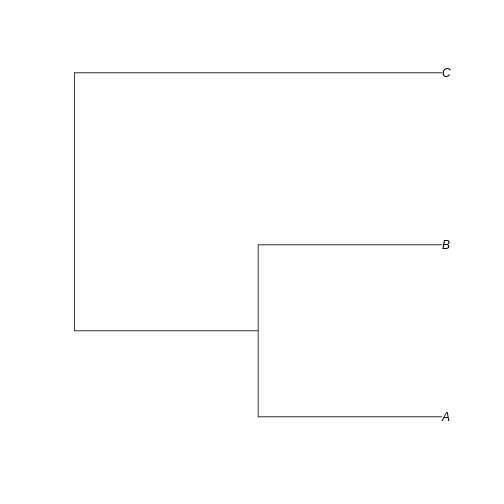

::: questions

- What information is contained in phylogenies?
- How to summarize and interpret phylogenies using Hill numbers?
- What are the common phylogeny data formats?
- How do you import and manipulate phylogeny data in R?
- How do you visualize phylogenies in R? 
- How do you calculate Hill numbers with phylogenetic data?

:::::::::::::


::: objectives

After following this episode, participants will be able to:

1. Identify key features of different phylogenetic data formats
2. Import, clean and manipulate phylogenetic data in the R environment
3. Visualize phylogenies
4. Calculate and interpret phylogenetic Hill numbers

::::::::::::::

## Introduction to phylogenetic data

In this episode, we will explore how to extract information from phylogenetic trees in order to complement our hypotheses and inferences about processes shaping biodiversity patterns. Phylogenetic trees have information about how the species in a taxonomic group are related to each other and how much relative evolutionary change has accumulated among them. Since local communities differ in their phylogenetic composition, this information can give insights on why communities are how they are.

[HERE INCLUDE VISUALS OF PHYLOGENIES]

The relative phylogenetic distance among species in a community as well as the distribution of the amount of evolutionary history (represented by the length of the branches in a phylogeny) are a result of different factors such as the age since the initial formation of the community and the rate of macroevolutionary processes such as speciation and extinction. For instance, young communities that are dominated by closely related species and show very short branch lengths may suggest a short history with few colonization events and high rates of local speciation; alternatively, if the same young communities harbor distantly related species with longer branch lengths, it may suggest that most of the local diversity was generated by speciation elsewhere followed by colonization events involving distantly related species. Coupled with information on ecological traits and rates of macroevolutionary processes, these patterns also allow to test for hypotheses regarding, for instance, ecological filtering or niche conservatism.

Summarizing this phylogenetic information (i.e., phylogenetic distance and distribution of branch lengths) is therefore important for inference. As we have seen in previous episodes, the use of [Hill numbers](https://onlinelibrary.wiley.com/doi/10.1111/eva.12593) is an informative approach to summarize biodiversity. 

[MORE HERE ON MEANING OF PHYLOGENETIC HILL, RELATING TO PHYLO CHARACTERISTICS]

## Working with phylogenetic data in R

### Importing phylogenetic data

Several file formats exist to store phylogenetic information. The most common formats are the [Newick and Nexus formats](https://evomics.org/resources/tree-formats/). Both these formats are plain text files storing different levels of information about the taxa relationship and evolutionary history. `Newick` files are the standard for representing trees in a computer-readable form, as they can be extremely simple and therefore do not take up much memory. `Nexus` file, on the other hand, are composed by different blocks regarding different types of information and can be used to store DNA alignments, phylogenetic trees, pre-defined groupings of taxa, or everything at once. Since they are a step ahead in complexity, we will stick with `Newick` files for now.

`Newick` files store the information about the clades in a tree by representing each clade within a set of parentheses. Sister clades are separated by `,`. The notation also requires us to add the symbol `;` to represent the end of the information for that phylogenetic tree.

The basic structure of a tree in a `Newick` format is therefore as follows:

((A,B),C);

The notation above indicates that:
1. we have three taxa in our tree, named `A`, `B` and `C`;
2. `A` and `B` form one clade (A,B);
3. the (A,B) clade is sister to the `C` clade (we represent that by adding another set of parentheses and a `,` separating (A,B) from C).

In addition, `Newick` files can also store information on the branch leading to it tip and node. We do that by adding `:` after each tip/node.

((A:0.5,B:0.5):0.5,C:1);

The notation above indicates that:
1. the branches containing A and B have each a length = 0.5;
2. the branch that leads to the node connecting A and B also has length = 0.5;
3. the branch leading to C has length = 1.

The notation above is what we import into R to start working with and manipulating our phylogenetic tree. For that goal, we will use the [ape](https://academic.oup.com/bioinformatics/article/20/2/289/204981) package:


```r
library(ape)
```

To import our tree, we will be using the function `read.tree()` from the `ape` package. In the case of simple trees as the one above, we could directly create them within R by giving that notation as a `character` value to this function, using the `text` argument, as shown below:


```r
example_tree <- read.tree(text = '((A:0.5,B:0.5):0.5,C:1);')
```

Now, we can visually inspect our tree using the `plot()` function:


```r
plot(example_tree)
```



Can you visualize the text notation in that image? We can see the same information: A is closer related to B than C, and the branches leading to A and B have half the length of the branch leading to C.

The `read.tree()` function creates an object of class `phylo`. We can further investigate this object by calling it in our console:


```r
example_tree
```

The printed information shows us that we have a phylogenetic tree with 3 tips and 2 internal nodes, where the tip labels are "A, B, C". We also are informed that this tree is rooted and has branch lengths.

One way to access the components of this object and better explore it is to use `$` after the object name. Here, it will be important for us to know a little bit more about where the information about tip labels and branch lengths are stored in that `phylo` object. Easy enough, we can access that by calling `tip.labels` and `edge.length` after `$`.


```r
example_tree$tip.label
example_tree$edge.length
```

## Cleaning and filtering phylogenetic data

Now that we learned how to import and visualize trees in R, let's bring the phylogeny for the communities we are working with in this workshop. Our data so far consists of [abundances](abundance-data.Rmd) and [traits](traits-data.Rmd) of several taxa of arthropods collected across three islands in the Hawaian archipelago. Let's work though importing phylogenetic information for these species.

**Two options of getting phylogeny: either you have your favorite published phylogeny for your group, or you search from a database like Open Tree of Life**
- Bring `rotl` as an option, refer to [existing tutorial](https://mctavishlab.github.io/R_OpenTree_tutorials/). With otl, you will have your phylogeny ready and just need to filter for local communities.
- The other option, using an existing published phylogeny, is what we are going for here. Issue to address: 1) species in local that are missing in phylo.
> Keep this issue for now, but check with Andy if will remove later.


```r
arthro_tree
```

```{.error}
Error in eval(expr, envir, enclos): object 'arthro_tree' not found
```

```r
class(arthro_tree)
```

```{.error}
Error in eval(expr, envir, enclos): object 'arthro_tree' not found
```

This new `phylo` object is way larger than the previous one, being a "real" phylogeny and all. You can inspect it again by directly calling the object `phylogeny`. To plot it, we will use the `type` argument to modify how our tree will be displayed. Here, we used the option `'fan'`, to display a circular phylogeny (slightly better to show such a large phylogeny in the screen).


```r
plot(arthro_tree, type = 'fan', show.tip.label = F)
```

```{.error}
Error in eval(expr, envir, enclos): object 'arthro_tree' not found
```

How do we combine all this information with the community datasets we have so far for our three islands? First, we will have to perform some cleaning.

Often, when we want to include the phylogenetic relatedness of organisms in our biodiversity analyses, we will run into published phylogenetic trees for our focal taxon (that is the case of the tree we are using here). A couple issues arise in these cases. First, and maybe most importantly, we need to make sure that the taxonomic names used across the different datasets in our analyses (phylogenies included) are the same. A second issue is that, depending on the resolution of the published phylogeny, it may be the case that some taxa in our community dataset may not be explicitly represented in the phylogeny. In these cases, we will want to assign those "missing taxa" to one of the tips present in the tree, based on their known genus and/or family assignments.

### Resolving missing tip names

The next issue we need to address is the fact that we may have species in our dataset that are not present in the phylogenetic tree we are using. We therefore need to 1) find out which species are not in the tree; 2) assign them to tips that are present in the tree.

For this, let's refer back to our original species list and cross-check it against the list of names we were able to find good OTT IDs for.


```r
all_names <- (abundances$final_name)
```

```{.error}
Error in eval(expr, envir, enclos): object 'abundances' not found
```

```r
found_names <- good_names$search_string
```

```{.error}
Error in eval(expr, envir, enclos): object 'good_names' not found
```

```r
unfound_names <- setdiff(all_names, found_names)
```

```{.error}
Error in eval(expr, envir, enclos): object 'all_names' not found
```

The taxonomic names in both the abundance data and in the phylogenetic tree were corrected using the same database from `taxize`; this therefore means that any names from our abundance data that are not found in the tree simply represent taxa that are not included in this phylogeny. We can use the boolean operator `%in%` coupled with `!` to check `species_names` that are not included in the `phylogeny$tip.label`. In summary, the expression `A %in% B` would return the positio of the elements in vector A that are present in vector B. The `!` (NOT) operator returns the opposite of that expression, in a way that `!(A %in% B)` will return the position of elements in vector A that are *NOT* present in vector B (precisely what we need right now).


```r
not_present <- !(all_names %in% (phylogeny$tip.label))
```

```{.error}
Error in eval(expr, envir, enclos): object 'all_names' not found
```

The object `not_present` is now a vector of the positions (or indexes) of the elements in `species_name` that are not found in `phylogeny$tip.label`. Let's then check their names by using these indexes to subset `species_name`:


```r
all_names[not_present]
```

```{.error}
Error in eval(expr, envir, enclos): object 'all_names' not found
```

Here, we can decide how we are going to assign these species to tips in our tree. For instance, we see that we do not have _XXX_ in our tree, but we have _XXX_, which belongs to the same genus. Similarly...

We can then give new names to these species, based on what tips in our tree we want them to match to. To do so, we will first duplicate our `species_name` vector, so we can keep the original names (just in case we want to check the original names again in the future).


```r
species_name[not_present] <- c()
```

```{.error}
Error: object 'species_name' not found
```

```r
new_names[not_present] <- c()
```

```{.error}
Error: object 'new_names' not found
```

Now that we have a vector of updated named, all we need to do is modify those names in our site-by-species matrix. Similarly, we will first copy our matrix into another object (in order to keep the original abundance matrix intact), and then we will rename the columns of this new object based on the modified names.


```r
phylo_wide <- abundance_wide
```

```{.error}
Error in eval(expr, envir, enclos): object 'abundance_wide' not found
```

```r
colnames(phylo_wide) <- new_names
```

```{.error}
Error in eval(expr, envir, enclos): object 'new_names' not found
```

:::::::::::::::::: instructor

    Another issue that can arise with phylogenies is that when we assign species to a tip, we may end up with duplicates in the site-by-species matrix. We will not show this here, but it might be something important to bring up.

:::::::::::::::::::::::::::::::::::::::::::::::::::

### Filtering for local communities


After solving these issues, we now have 1) a phylogenetic tree with tip labels taxonomically cleaned; 2) a site-by-species matrix where all species are represented in our tree. These two objects are the two bits of information that we need to summarize the phylogenetic diversity and the distribution of branch lengths across our focal communities.

## Summarizing with hill numbers

In this section, we will extract some summary statistics about the pattern of phylogenetic diversity in our communities. As we discussed above, the relative phylogenetic distance among species and the distribution of this distance can give insights into processes of community assembly. Here, we will make use of [Hill numbers](https://onlinelibrary.wiley.com/doi/10.1111/eva.12593) to extract summaries of phylogenetic distances. To understand what they mean, let's first explore their properties in a simple example.

Let's assume we have a community with eight taxa: A through H. We will create two possibilities of phylogenetic relationship among them.

Tree 1 will represent a totally unbalanced pattern...


```r
tree1 <- read.tree(text='(A:7,(B:6,(C:5,(D:4,(E:3,(F:2,(G:1,H:1):1):1):1):1):1):1);')
plot(tree1)
```

whereas tree 2 will represent a totally balanced pattern.


```r
tree2 <- read.tree(text='(((A:1,B:1):1,(C:1,D:1):1):1,((E:1,F:1):1,(G:1,H:1):1):1);')
plot(tree2)
```

Notice that both trees are ultrametric: all tips align at the end, representing extant taxa, which means branch lengths here represent the amount of time that has passed between each node. The difference between the first and the second tree resides in the fate of each new lineage at a node. In the first tree, at each diversification event, one of the lineages always persists till the present with no change while the other undergoes another round of diversification. In the second tree, both lineages from each node undergo a new split. The consequence is that in tree 2, all extant species result from recent diversification (i.e., they have a short evolutionary history before coalescing into their ancestor), whereas in tree 1 we have a mix of old and recent lineages.

To visualize how these different patterns reflect in the diversity metric, we will calculate the phylogenetic Hill number using the function `hill_phylo` from the `hillR` package. This function takes in a global phylogeny as well as a site-by-species matrix, and returns phylo Hill numbers for each site based on which species are present there. For our fictional example, we will create a matrix with only one site where all eight species in the tree are present. We do that by creating a vector of the value `1` repeated 8 times, transforming that to a dataframe, and then naming the columns with the names of the species we take from our fictional trees.


```r
mat <- data.frame(rbind(rep(1,8)))

colnames(mat) <- c('A','B','C','D','E','F','G','H')
```

Using that matrix, we will calculate Hill numbers of order 0 to 2 for both trees:


```r
library(hillR)
tree1_h0 <- hill_phylo(mat,tree1,q=0)
tree1_h1 <- hill_phylo(mat,tree1,q=1)
tree1_h2 <- hill_phylo(mat,tree1,q=2)
tree2_h0 <- hill_phylo(mat,tree2,q=0)
tree2_h1 <- hill_phylo(mat,tree2,q=1)
tree2_h2 <- hill_phylo(mat,tree2,q=2)
```

Let's format this as a dataframe so we can visualize these numbers: the first column will be the order (our X axis), the second column will be the Hill values (our Y axis) and the third column will be the tree it belongs to (which we will use to draw different colored lines for comparison).


```r
phylo_h <- data.frame(order = c(0,1,2,0,1,2),
                      hill = c(tree1_h0,tree1_h1,tree2_h2,tree2_h0,tree2_h1,tree2_h2),
                      tree = c(rep('tree1',3),rep('tree2',3)))
```

Now we will call `plot` to generate a line plot for the values of the first tree, and then use `lines` to add a line containing the values for the second tree (we used boolean matching subsetting to choose what to plot at each time)


```r
#Plotting values for tree 1
plot(phylo_h$order[phylo_h$tree=='tree1'],
     phylo_h$hill[phylo_h$tree=='tree1'],
     type='b',col='darkred',
     xlab = 'Order',ylab='Hill values')

# Plotting values for tree 2
lines(phylo_h$order[phylo_h$tree=='tree2'],
     phylo_h$hill[phylo_h$tree=='tree2'],
     type='b',col='red')
```

From this plot, we can notice a few patterns:

1) The hill values for tree 1 are usually higher than those for tree 2, indicating that our community contains a deeper evolutionary history with tree 1 (i.e., lineages containg longer branches);
2) The value of the hill numbers drop as the order goes up. This happens because higher orders are putting less and less emphasis on branch lengths that are not so common (like, for instance, the short branch lenghts in tree 1). In order words, higher order emphasize what is more common.
3) The rate of change of the value as we increase the order is also different among trees. Tree 1 is a more uneven tree; it is composed mostly of somewhat long branches, and few short branches. So, when we change the order, we notice a significant change in the value (at least more significant than the change seen in tree2), because there's a part of the tree we are starting to disconsider (i.e., those short branch lengths that are not so common). We observe a smaller change in tree 2 because all branches have very similar lenghts, so changing the order does not affect the overall diversity (in other words, all branch lenghts are equally common, so emphasize more or less common lenghts does not change much the values).

What would happen if the taxa in our communities had different relative abundances? In this case, not only the relative frequency of a branch length would affect our summary statistic, but also how abundant is the taxon that has each branch length. For instance, in tree 1, even though long branches are over represented, maybe the species with long branches are actually super rare in our community, and the short-branch species are actually super abundant. As you can probably realize, this difference suggests something about the evolutionary history of our community, in this case that the most abundant species have a very recent evolutionary history. Similarly, even though branch lengths are very even in tree 2, if some of the species is more abundant than others, it suggests that the evolutionary history of the tree is unevenly represented in our community.

Conveniently, the `hill_phylo` function will take into account both the relative frequency of branch lenghts *AND* the abundance of extant taxon in the phylogeny we provide. For our simple example, we can see how that changes our results by creating site-by-species matrix where abundance goes up from species A to species H (for simplicity, we'll just use values from 1 to 8).


```r
mat <- data.frame(rbind(seq(1,8)))
colnames(mat) <- c('A','B','C','D','E','F','G','H')
```

Now, let's calculate the same hill numbers with this new community. We save the values to objects with `_rel` at the end, to highlight in this case the taxa had different *rel*ative abundances.


```r
tree1_h0_rel <- hill_phylo(mat,tree1,q=0)
tree1_h1_rel <- hill_phylo(mat,tree1,q=1)
tree1_h2_rel <- hill_phylo(mat,tree1,q=2)
tree2_h0_rel <- hill_phylo(mat,tree2,q=0)
tree2_h1_rel <- hill_phylo(mat,tree2,q=1)
tree2_h2_rel <- hill_phylo(mat,tree2,q=2)
```

Then we add the new values to our `phylo_h` dataframe. We will signal they belong to `tree1_rel` and `tree2_rel`, meaning they came from a community with different *rel*ative abundance.


```r
phylo_h <- rbind(phylo_h,
                 data.frame(order = c(0,1,2,0,1,2),
                            hill = c(tree1_h0_rel,tree1_h1_rel,tree1_h2_rel,
                                     tree2_h0_rel,tree2_h1_rel,tree2_h2_rel),
                            tree = c(rep('tree1_rel',3),rep('tree2_rel',3))))

#Plotting values for tree 1
plot(phylo_h$order[phylo_h$tree=='tree1'],
     phylo_h$hill[phylo_h$tree=='tree1'],
     type='b',col='darkred',
     xlab = 'Order',ylab='Hill values',
     ylim = range(phylo_h$hill))

# Plotting values for tree 2
lines(phylo_h$order[phylo_h$tree=='tree2'],
     phylo_h$hill[phylo_h$tree=='tree2'],
     type='b',col='red')

# Plotting values for tree 2
lines(phylo_h$order[phylo_h$tree=='tree1_rel'],
     phylo_h$hill[phylo_h$tree=='tree1_rel'],
     type='b',col='darkblue')

# Plotting values for tree 2
lines(phylo_h$order[phylo_h$tree=='tree2_rel'],
     phylo_h$hill[phylo_h$tree=='tree2_rel'],
     type='b',col='lightblue')
```

Reminders: 1) red is equal abundance and blue is different abundances; 2) darker colors represent `tree1` (uneven branch length) and lighter colors represent `tree2` (equal branch lengths).

From this second plot, we notice that:

1) Hill number values for tree 1 (darker colors) are still higher than those for tree 2 (lighter colors). This makes sense since the relative abundance is the same for both trees, so the overall pattern (i.e., longer branches in tree 1) remains;

2) the Hill number of order 0 is the same regardless of whether you have different relative abundances among species, since order 0 is simply the sum of all branch lengths (i.e., it does not account for how the relative abundance of taxa);

3) when we include different relative abundance among taxa, we have a higher rate of decrease in the Hill number value as we increase the order. This is because higher orders are now being calculated based on how common/rare each branch is in our community (based on our site-by-species matrix). If we take tree 1, for instance, we see that the Hill value for order 1 including different taxa abundance (darker blue line) is lower than the value where abundance is equal (darker red line). We can interpret this as our metric putting less weight on the longer branches of tree 1, which are rare in our community, and putting more weight on the shorter branches, which are more common but represent a more recent evolutionary history. We see a similar (although less accentuated) pattern with tree2. Calculating different order of hill numbers while incorporating species abundance therefore allows to have a single metric accounting for evolutionary history and species abundance distribution that is comparable across different regions.

:::::::::::::::::: instructor
    
    A question that may arise from the audience is why for order 2 the matrix with different taxa abundance yields higher Hill number value (i.e., it is the reverse of the pattern for order 1). This may give an opportunity to further discuss how Hill numbers are balancing out relative abundance with evolutionary history. I believe order 2 is reflecting that the high abundance of short branch taxa (like G and H) yields higher PD than when we don't have thar relative abundance and are just focusing on the few long branch taxa (like A and B).

:::::::::::::::::::::::::::::::::::::::::::::::::::

::: challenge

Now that you got an intuition on the information phylogenetic Hill numbers can give us, let's move on to our actual data. For this challenge, you should calculate the phylogenetic Hill numbers of orders 0, 1 and 2 for three islands we are working with throughout these episodes. The key objects here will be the `phylogeny` tree we imported earlier, as well as the `phylo_wide` object containing our site-by-species matrix modified to match the tips in our phylogeny. You should also plot the hill numbers for each island and discuss what the calculated values allow you to infer regarding the history of each community.

::: solution

<!-- We gotta simulate the data to finalize this solution section. -->

::::::::::::

::::::::::::


## Graveyard

Because the entire tree of 


```r
library(rotl)

abundances <- read.csv("https://raw.githubusercontent.com/role-model/multidim-biodiv-data/rmd-review/episodes/data/abundances_resolved.csv")

# This is kind of a mixed cleaning/analysis interlude that seems like it belongs below.

resolved_names <-  tnrs_match_names(abundances$final_name)
```

```{.warning}
Warning: Some names were duplicated: 'holcobius insignis', 'schrankia simplex',
'trigonidium flectens', 'xyleborus vulcanus', 'aleurothrixus floccosus',
'cardiocondyla wroughtonii', 'carposina mauii', 'fannia canicularis', 'syntormon
distortitarsis'.
```

```{.warning}
Warning: anomalochrysa fulvescens rhododora, tegonotus hibiscella, coccygomimus
punicipes, heterocrossa plumbeonitida, pararrhaptica dermatopa, brontolaemus
currax mauiensis, cremastus flavoorbitalis, cydia plicata, emperoptera
zimmermani, heterocrossa atronotata, pararrhaptica perkinsana, phlyctaenia
liopis are not matched
```

```r
# Remove names that aren't a perfect match

good_names <- resolved_names[ !resolved_names$approximate_match,]
good_names <- good_names[ !is.na(good_names$approximate_match), ]

# Remove a couple of ott ids that seem to confuse tol_induced_subtree

good_names <- good_names[ good_names$ott_id != "3574707", ]
good_names <- good_names[ good_names$ott_id != "737065", ]
```

Next, we can query the Open Tree of Life for those IDs using the `tol_induced_subtree` function.


```r
arthro_tree <- tol_induced_subtree(ott_id = (good_names$ott_id))
```

```{.warning}
Warning in collapse_singles(tr, show_progress): Dropping singleton nodes
with labels: Mandibulata ott985907, mrcaott100ott705, mrcaott100ott131202,
mrcaott100ott98461, Insecta ott1062253, Dicondylia ott983656, mrcaott100ott3046,
Amphiesmenoptera ott436623, Lepidoptera ott965954, mrcaott100ott89153,
mrcaott100ott89149, Glossata ott89155, mrcaott100ott14487, Heteroneura
(parvorder in superorder Amphiesmenoptera) ott795150, mrcaott100ott1356,
mrcaott100ott119406, mrcaott100ott91816, Ditrysia ott596629, mrcaott100ott29260,
mrcaott100ott422158, mrcaott100ott371798, mrcaott100ott9946, mrcaott100ott9956,
mrcaott100ott62459, mrcaott100ott2624, mrcaott2624ott4617, mrcaott2624ott9944,
mrcaott2624ott3242, mrcaott3242ott4581, Ophiusa ott823720, mrcaott4392ott4777,
mrcaott4777ott12094, mrcaott4777ott59111, mrcaott4777ott21220, Hadeninae
ott627470, Leucania ott935040, Athetis ott692336, Bombycoidea ott596647,
mrcaott4406ott14359, mrcaott4406ott11174, mrcaott4406ott195487,
mrcaott4406ott4577, Sphingidae ott598255, Macroglossinae (subfamily in
Protostomia) ott5227729, mrcaott3093348ott3093388, mrcaott3093388ott3094031,
mrcaott3093388ott3094059, mrcaott3093388ott3093670, mrcaott3093388ott3093590,
Philampelini ott5227874, Tinostoma ott3093591, mrcaott1363ott18439,
mrcaott1363ott131472, mrcaott1363ott144110, mrcaott1363ott22028,
mrcaott1363ott22025, mrcaott22025ott96804, Crambinae ott910673, Mestolobes
ott3168439, mrcaott4615ott20828, mrcaott677ott95584, mrcaott677ott6210,
mrcaott677ott3236, mrcaott677ott9938, mrcaott677ott2248, mrcaott2248ott103674,
mrcaott2248ott8214, mrcaott12735ott103660, mrcaott12735ott24989,
mrcaott12735ott28039, mrcaott28039ott31514, Nymphalinae ott809887,
mrcaott28039ott125890, mrcaott28039ott47978, Nymphalini ott803100,
mrcaott28039ott103027, mrcaott28039ott75325, mrcaott28039ott113234, Vanessa
ott581035, mrcaott206773ott624275, mrcaott2980ott6188, mrcaott6188ott346969,
mrcaott6188ott58611, mrcaott6188ott433422, mrcaott6188ott6195,
mrcaott6188ott855018, mrcaott6188ott84028, mrcaott6188ott8912,
mrcaott6188ott7874, mrcaott6188ott128114, mrcaott6188ott267747,
mrcaott6188ott390106, mrcaott6188ott3142238, mrcaott6188ott272268,
mrcaott6188ott3143370, mrcaott6188ott128096, mrcaott6188ott6837,
mrcaott6188ott579538, mrcaott6188ott31414, mrcaott31414ott39138,
mrcaott31414ott58608, mrcaott58608ott123537, mrcaott123537ott941752,
mrcaott123537ott174789, mrcaott174789ott3147936, Lampides ott174793,
mrcaott10883ott43864, mrcaott43864ott117178, mrcaott117178ott146833,
mrcaott117178ott117616, Copromorphoidea ott371738, Carposinidae
ott384724, mrcaott4942ott9053, mrcaott9053ott39947, Gelechiidae ott926504,
mrcaott12981ott108952, Pexicopiinae ott765581, Pectinophora ott108954,
mrcaott39244ott187325, Chrysopeleiinae ott299538, Stagmatophora ott3232562,
Cosmopteriginae ott299539, mrcaott35093ott91777, mrcaott35093ott45523,
mrcaott45523ott327236, mrcaott45523ott422164, Autostichidae ott736026,
Autostichinae ott465581, Stoeberhinus ott369965, Hofmannophila ott922199,
mrcaott3239ott8963, mrcaott8963ott996125, Tortricoidea ott596646, Tortricidae
ott116636, mrcaott8963ott62467, Olethreutinae ott33152, mrcaott8963ott23795,
mrcaott8963ott20818, mrcaott8963ott39951, Grapholitini ott94673,
Cryptophlebia ott382084, Tortricinae ott930088, mrcaott10899ott19235,
mrcaott19235ott146771, mrcaott19235ott68324, mrcaott19235ott240447, Archipini
ott33138, Epiphyas ott930094, mrcaott6619ott45827, mrcaott6619ott14148,
Gracillariidae ott741184, Philodoria ott3038696, mrcaott1360ott1366,
mrcaott1360ott152422, mrcaott1360ott54997, mrcaott54997ott163491,
mrcaott163491ott167487, Erechthiinae ott821290, Erechthias ott167489,
mrcaott107ott8113, Diptera ott661378, mrcaott107ott1037379, mrcaott107ott460635,
mrcaott107ott487056, mrcaott107ott633, mrcaott633ott7556, Calyptratae
ott758893, mrcaott633ott638, mrcaott633ott15696, Oestroidea ott184522,
mrcaott646ott52674, mrcaott646ott11187, mrcaott646ott351518, Tachininae
ott511774, Siphonini ott115750, Actia ott535037, Calliphoridae ott1011003,
Luciliinae ott240460, Muscidae ott484752, Coenosiinae ott573704, Coenosiini
ott314922, Fanniidae ott672492, Fannia ott557410, mrcaott1874ott269894,
mrcaott1874ott26327, Drosophilidae ott34905, Drosophilinae ott127994,
mrcaott3952ott204763, mrcaott3952ott661518, mrcaott3952ott126940,
mrcaott3952ott26987, mrcaott3952ott15290, mrcaott3952ott12789, virilis group
ott812297, mrcaott12789ott660821, mrcaott32496ott63100, mrcaott63100ott91811,
truncipenna subgroup ott91812, nudidrosophila group ott122997, Parascaptomyza
ott584593, Grimshawomyia ott1047404, mrcaott4410ott86627, mrcaott4410ott34895,
mrcaott4410ott34911, mrcaott4410ott35517, montium subgroup ott863010,
mrcaott4410ott86632, mrcaott4410ott232128, mrcaott232128ott793217,
Ephydrinae ott828141, Notiphila ott1075980, Ephydra ott936922, Discomyzinae
ott732281, Psilopa ott755023, Chlorichaeta ott4424614, mrcaott4865ott749367,
mrcaott4865ott24836, mrcaott4865ott108552, mrcaott4865ott769421,
mrcaott4865ott6576, mrcaott11356ott11618, Tephritinae ott988300, Tephritini
ott1038711, Tephritis genus group ott6886, mrcaott781866ott4402365,
mrcaott4402390ott4405017, Phaeogramma ott4405016, Platystomatidae ott430300,
Scholastinae ott5836021, Scholastes ott4407260, Piophilidae ott1007135,
Piophilinae ott411501, Piophila ott713613, mrcaott16816ott138649,
Chyromyidae ott919068, Chyromyinae ott602980, Gymnochiromyia ott940820,
mrcaott8704ott21730, mrcaott21730ott110761, mrcaott21730ott43178,
mrcaott21730ott316608, mrcaott21730ott793421, Canacidae ott723458, Canaceoides
ott6262972, mrcaott338060ott667510, mrcaott338060ott545764, Chloropidae
ott1008045, Mepachymerus ott4415191, Pipunculidae ott361757, Pipunculinae
ott164981, Cephalopsini ott164980, Cephalops ott164983, Platypezoidea
ott133927, mrcaott997ott377813, mrcaott997ott265153, mrcaott997ott108555,
mrcaott997ott468461, Phoridae ott436667, Phorinae ott361756, Diplonevra
ott860664, Empidoidea ott653879, mrcaott7667ott26692, mrcaott7667ott41715,
mrcaott4332256ott4332346, mrcaott4332256ott5829684, mrcaott4332256ott5829685,
mrcaott4332256ott4332376, mrcaott4332256ott4332289, mrcaott4332256ott4332257,
mrcaott4332256ott4332265, mrcaott4332265ott4332320, mrcaott4332320ott4332387,
mrcaott4332320ott4332467, mrcaott4332467ott5829696, Syntormon ott340994,
Hydrophorinae ott758549, Sigmatineurum ott4339370, mrcaott3333ott6086,
mrcaott6086ott13469, mrcaott13469ott61651, mrcaott13469ott621658,
mrcaott13469ott206772, mrcaott13469ott134346, Stratiomyidae ott816777, Evaza
ott4447725, mrcaott6301ott373197, mrcaott6301ott274230, mrcaott6301ott125716,
Bibionomorpha ott860948, Sciaroidea ott199311, mrcaott6301ott185073,
mrcaott6301ott36995, mrcaott6301ott20673, mrcaott20673ott730893, Cecidomyiidae
ott933819, Cecidomyiinae ott286205, Cecidomyiidi ott496622, Cecidomyiini
ott318540, Cecidomyia ott7283762, mrcaott451ott168961, mrcaott451ott2372,
Chironomoidea ott722874, Orthocladiinae ott836368, Clunio ott158195,
Chironominae ott821752, Chironomini ott175472, Polypedilum ott297468,
Polypedilum subgenus Polypedilum ott6267673, Ceratopogonidae ott250528,
Forcipomyiinae ott836375, Culicoidea ott722897, mrcaott605ott250527,
Culicidae ott269670, Culicinae ott767855, Aedini ott134716, Stegomyia
ott565822, mrcaott6635ott98011, Tipulomorpha ott860956, Tipuloidea
ott722875, mrcaott6635ott38943, mrcaott6635ott561305, mrcaott6635ott53942,
Limoniinae ott423691, Dicranomyia ott868228, Polyphaga (suborder in
cohort Holometabola) ott684689, Cucujiformia ott684692, mrcaott387ott3369,
mrcaott4971ott189433, mrcaott4971ott14239, mrcaott4971ott14229,
mrcaott14229ott38993, mrcaott14229ott52345, Ciidae ott372251, Ciinae
ott938293, mrcaott413ott53385, mrcaott413ott191511, mrcaott413ott58432,
mrcaott413ott199885, mrcaott413ott13101, mrcaott413ott69410, mrcaott413ott11612,
mrcaott413ott88943, mrcaott413ott3611, mrcaott413ott41088, Scolytinae
ott7170362, mrcaott515ott149634, mrcaott515ott3411482, Anthribidae ott61017,
Choraginae ott710616, Araecerus ott710605, Cyclominae ott352714, Listroderini
ott353638, Listroderes ott980517, Belidae ott211889, mrcaott5668ott9643,
mrcaott9643ott35271, Bruchinae ott190023, Pachymerini ott785323, Caryedon
ott460612, mrcaott11244ott21732, mrcaott409ott14504, mrcaott409ott3
```

In this section, we will deal with these issues in order to prepare our data for community inferences. Our first issue will be dealt with in a challenge!

### Resolving taxonomic names

::: challenge

In previous episodes, we have used the package `taxize` to clean and standardize the taxonomic names in out dataset. Here, we will apply the same approach to the tip names of our phylogeny. We need to make sure the names we will accept from `taxize` will match the names we have accepted in previous episodes. Finally, after we decide on the names, we need to add them to the `phylogeny` objects, where the tip names are stored.

::: solution

First, we check the names using the `gnr_resolve()` function. In `phylogeny`, tip names are stored in `phylogeny$tip.label`, so we provide that vector to our function.


```r
library(taxize)
```

```{.output}

Attaching package: 'taxize'
```

```{.output}
The following objects are masked from 'package:rotl':

    synonyms, tax_name, tax_rank
```

```r
phylogeny <- arthro_tree

phylo_tip_names <- phylogeny$tip.label

for(i in 1:length(phylo_tip_names)) {
    phylo_tip_names[i] <- strsplit(phylo_tip_names[i][1], "_ott")[[1]][1]
     phylo_tip_names[i] <- gsub("_", " ", phylo_tip_names[i])
}


phylo_tip_names

name_resolve <- gnr_resolve(phylo_tip_names, best_match_only = TRUE, canonical = TRUE)
head(name_resolve)
```

We can see what taxa are in conflict with the names retrieved by `taxize` by subsetting `name_resolve` based on boolean matching.


```r
mismatches_phylo <- name_resolve[name_resolve$user_supplied_name != name_resolve$matched_name2, c("user_supplied_name", "matched_name2")]

mismatches_phylo
```

From here, we can see that apparently there are no misspellings in our tree (as expected from a published phylogeny). Most of the mismatches seem to be related to changes in the taxonomic treatment of species. This is a common situation, since taxonomic treatments are often revised after new trees are published; it might be the case that `nameA` in our dataset was treated as `nameB` at the time the phylogeny was created.

In the previous episodes, we used the names provided by `taxize` directly. Therefore, here we can just add those names directly to the phylogeny.


```r
phylogeny$tip.label <- name_resolve$matched_name2
```

::::::::::::

::::::::::::

**RMD commenting May 26. With taxize down, and using `rotl` for both name resolution and getting the phylogeny, there aren't going to be mismatched names in the phylogeny.**

**But, there is the potential for missing names...**

**For now, RMD is commenting out the phylo cleaning section. If we end up continuing with `rotl` for both cleaning + phylo, I think there will be an opportunity to do name/broken taxon fixing. Some of this is covered in an R Open Tree of Life Carpentries lesson here: https://mctavishlab.github.io/R_OpenTree_tutorials/03-broken-taxa/index.html (which is what RMD is working from).**


