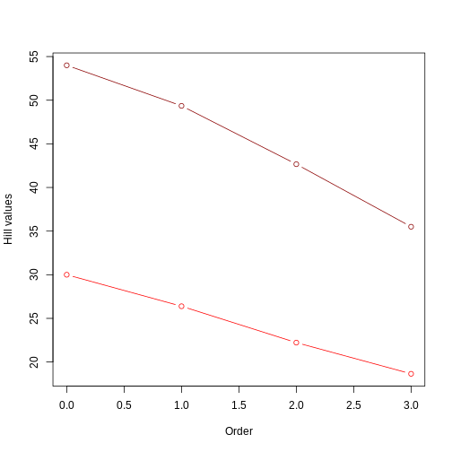

::: questions

- What information is contained in phylogenies?
- How to summarize and interpret phylogenies using Hill numbers?
- What are the common phylogeny data formats?
- How do you import and manipulate phylogeny data in R?
- How do you visualize phylogenies in R? 
- How do you calculate Hill numbers with phylogenetic data?

:::::::::::::


::: objectives

After following this episode, participants will be able to:

1. Identify key features of the Newick format
2. Import and manipulate phylogenetic data in the R environment
3. Visualize phylogenies
4. Calculate and interpret phylogenetic Hill numbers

::::::::::::::

## Introduction to phylogenetic data

In this episode, we will explore how to extract information from phylogenetic trees in order to complement our hypotheses and inferences about processes shaping biodiversity patterns. Phylogenetic trees have information about how the species in a taxonomic group are related to each other and how much relative evolutionary change has accumulated among them. Since local communities differ in their phylogenetic composition, this information can give insights on why communities are how they are.

[HERE INCLUDE VISUALS OF PHYLOGENIES]

The relative phylogenetic distance among species in a community as well as the distribution of the amount of evolutionary history (represented by the length of the branches in a phylogeny) are a result of different factors such as the age since the initial formation of the community and the rate of macroevolutionary processes such as speciation and extinction. For instance, young communities that are dominated by closely related species and show very short branch lengths may suggest a short history with few colonization events and high rates of local speciation; alternatively, if the same young communities harbor distantly related species with longer branch lengths, it may suggest that most of the local diversity was generated by speciation elsewhere followed by colonization events involving distantly related species. Coupled with information on ecological traits and rates of macroevolutionary processes, these patterns also allow to test for hypotheses regarding, for instance, ecological filtering or niche conservatism.

Summarizing this phylogenetic information (i.e., phylogenetic distance and distribution of branch lengths) is therefore important for inference. As we have seen in previous episodes, the use of [Hill numbers](https://onlinelibrary.wiley.com/doi/10.1111/eva.12593) is an informative approach to summarize biodiversity. 

[MORE HERE ON MEANING OF PHYLOGENETIC HILL, RELATING TO PHYLO CHARACTERISTICS]

## Working with phylogenetic data in R

### Importing phylogenetic data

Several file formats exist to store phylogenetic information. The most common formats are the [Newick and Nexus formats](https://evomics.org/resources/tree-formats/). Both these formats are plain text files storing different levels of information about the taxa relationship and evolutionary history. `Newick` files are the standard for representing trees in a computer-readable form, as they can be extremely simple and therefore do not take up much memory. `Nexus` file, on the other hand, are composed by different blocks regarding different types of information and can be used to store DNA alignments, phylogenetic trees, pre-defined groupings of taxa, or everything at once. Since they are a step ahead in complexity, we will stick with `Newick` files for now.

`Newick` files store the information about the clades in a tree by representing each clade within a set of parentheses. Sister clades are separated by `,`. The notation also requires us to add the symbol `;` to represent the end of the information for that phylogenetic tree.

The basic structure of a tree in a `Newick` format is therefore as follows:

((A,B),C);

The notation above indicates that:
1. we have three taxa in our tree, named `A`, `B` and `C`;
2. `A` and `B` form one clade (A,B);
3. the (A,B) clade is sister to the `C` clade (we represent that by adding another set of parentheses and a `,` separating (A,B) from C).

In addition, `Newick` files can also store information on the branch leading to it tip and node. We do that by adding `:` after each tip/node.

((A:0.5,B:0.5):0.5,C:1);

The notation above indicates that:
1. the branches containing A and B have each a length = 0.5;
2. the branch that leads to the node connecting A and B also has length = 0.5;
3. the branch leading to C has length = 1.

The notation above is what we import into R to start working with and manipulating our phylogenetic tree. For that goal, we will use the [ape](https://academic.oup.com/bioinformatics/article/20/2/289/204981) package:


```r
library(ape)
```

To import our tree, we will be using the function `read.tree()` from the `ape` package. In the case of simple trees as the one above, we could directly create them within R by giving that notation as a `character` value to this function, using the `text` argument, as shown below:


```r
example_tree <- read.tree(text = '((A:0.5,B:0.5):0.5,C:1);')
```

Now, we can visually inspect our tree using the `plot()` function:


```r
plot(example_tree)
```


Can you visualize the text notation in that image? We can see the same information: A is closer related to B than C, and the branches leading to A and B have half the length of the branch leading to C.

The `read.tree()` function creates an object of class `phylo`. We can further investigate this object by calling it in our console:


```r
example_tree
```

The printed information shows us that we have a phylogenetic tree with 3 tips and 2 internal nodes, where the tip labels are "A, B, C". We also are informed that this tree is rooted and has branch lengths.

One way to access the components of this object and better explore it is to use `$` after the object name. Here, it will be important for us to know a little bit more about where the information about tip labels and branch lengths are stored in that `phylo` object. Easy enough, we can access that by calling `tip.labels` and `edge.length` after `$`.


```r
example_tree$tip.label

example_tree$edge.length
```

## Cleaning and filtering phylogenetic data

Now that we learned how to import and visualize trees in R, let's bring the phylogeny for the communities we are working with in this workshop. Our data so far consists of [abundances](abundance-data.Rmd) and [traits](traits-data.Rmd) of several taxa of arthropods collected across three islands in the Hawaiian archipelago. Let's work though importing phylogenetic information for these species.

Two common approaches to retrieving a phylogeny for a focal group are 1) relying on a published phylogeny for the group, or 2) surveying public phylogenetic databases based on your taxa list. A common option for the latter is the [Open Tree of Life Taxonomy](https://tree.opentreeoflife.org/about/taxonomy-version/ott3.2), a public database that synthesizes taxonomic information from different sources. You can even interact with this database using the R package `rotl`. A few tutorials to do so exist online, like [this one](https://mctavishlab.github.io/R_OpenTree_tutorials/). Using a public database is a good approach when working with taxonomic groups that are not heavily investigated regarding their phylogenetic relationships (the well-known [Darwinian shortfall](https://doi.org/10.1146/annurev-ecolsys-112414-054400)). In such cases, databases like OTL will give you a summary phylogeny already filtered for the taxa you have in hand and cross-checked for synonyms and misspellings.

For this workshop, since we are using simulated data, we will work with the first option: a "published" arthropod phylogeny. Let's load this phylogeny into R using the function `read.tree` we learned earlier.


```r
arthro_tree <- read.tree('LINK_TO_PHYLOGENY')
```

```{.warning}
Warning in file(file, "r"): cannot open file 'LINK_TO_PHYLOGENY': No such file
or directory
```

```{.error}
Error in file(file, "r"): cannot open the connection
```

```r
class(arthro_tree)
```

```{.error}
Error in eval(expr, envir, enclos): object 'arthro_tree' not found
```

This new `phylo` object is way larger than the previous one, being a "real" phylogeny and all. You can inspect it again by directly calling the object `arthro_tree`. To plot it, we will use the `type` argument to modify how our tree will be displayed. Here, we used the option `'fan'`, to display a circular phylogeny (slightly better to show such a large phylogeny in the screen). We also set the `show.tip.label` argument to `False`.


```r
plot(arthro_tree, type = 'fan', show.tip.label = F)
```

```{.error}
Error in eval(expr, envir, enclos): object 'arthro_tree' not found
```

How do we combine all this information with the community datasets we have so far for our three islands? First, we will have to perform some name checking and filtering.

### Checking for missing tips

**Do we still want to keep this issue? Or simply skip ahead to pruning the phylogeny?**

Since this is a "published" arthropod phylogeny, we will likely not have any misspelling in the tip names of the object. However, one important issue that may arise is that, depending on the resolution of the phylogeny, it may be the case that some taxa in our community dataset may not be explicitly represented in the phylogeny. For instance, the tips in our phylogeny might be represented by one species for each genus, or one genus for each family. This is usually the case when the goal of the original publication was to elucidate the phylogenetic relationship for such higher taxonomic levels, with less focus on the more recent evolutionary history. In these cases, some taxa in our [abundances](abundance-data.Rmd) dataset may not be found in the phylogeny, which will yield errors when we try to summarize phylogenetic diversity. Therefore, we will want to assign those "missing taxa" to one of the tips present in the tree, based on their known genus and/or family assignments.

Let's first find out what are those "missing taxa". For this, we'll refer back to our original species list, from the `abundances` object:


```r
all_names <- abundances$final_name
```

```{.error}
Error in eval(expr, envir, enclos): object 'abundances' not found
```

To cross-check this list against the list of names in our phylogeny, we can use the Boolean operator `%in%` coupled with `!`. This will allow us to check for names in `all_names` that are not included in the `arthro_tree$tip.label`. In summary, the expression `A %in% B` would return the position of the elements in vector A that are present in vector B. The `!` (NOT) operator returns the opposite of that expression, in a way that `!(A %in% B)` will return the position of elements in vector A that are *NOT* present in vector B (precisely what we need right now).


```r
not_found <- !(all_names %in% (arthro_tree$tip.label))
```

```{.error}
Error in eval(expr, envir, enclos): object 'all_names' not found
```

The object `not_found` is now a vector of the positions (or *indexes*) of the elements in `all_names` that are not found in `arthro_tree$tip.label`. Let's then check these names by using these indexes to subset `all_names`:


```r
all_names[not_found]
```

```{.error}
Error in eval(expr, envir, enclos): object 'all_names' not found
```

**EDIT THIS NEXT PARAGRAPH WHEN PHYLOGENY IS AVAILABLE**

Here, we can decide how we are going to assign these species to tips in our tree. For instance, we see that we do not have **XXX** in our tree, but we have **XXX**, which belongs to the same genus. Similarly...

We can then give new names to these species, based on what tips in our tree we want them to match to. To do so, we will first duplicate our `all_names` vector into the `new_names` vector. This way, we can make our changes in `new_names` while keeping the original names intact, just in case we need to refer back to them in the future.


```r
new_names <- all_names
```

```{.error}
Error in eval(expr, envir, enclos): object 'all_names' not found
```

Now we use the indexes saved in `not_found` to replace the names in the positions with the ones we want:


```r
new_names[not_found] <- c('ADD_LIST_HERE')
```

```{.error}
Error: object 'new_names' not found
```

Now that we have a vector where all names match to a position in our phylogeny, we need to bring these corrected names back to our abundance data. Here, we will again first copy our `abundances` object into another object, in order to keep the original data intact. Then, we will change the column `final_name` based on the vector `new_names`.


```r
abundances_phylo <- abundances
```

```{.error}
Error in eval(expr, envir, enclos): object 'abundances' not found
```

```r
abundances_phylo$final_name <- new_names
```

```{.error}
Error in eval(expr, envir, enclos): object 'new_names' not found
```

### Pruning our phylogeny

Now that we have a modified abundance dataset where all taxa names are present in our phylogeny, we can work on pruning our phylogeny to the taxa present in our communities. This is especially important when working with published phylogenies as these are usually large files containing several taxa that may not exist in the local community.

We can prune our phylogeny using the function `keep.tip` from the `ape` package. For this function, we provide the entire phylogeny plus the names of the tips we want to keep. Here, we will retrieve those names from the new abundances dataset we create, with names corrected to match the phylogeny.


```r
arthro_tree_pruned <- keep.tip(arthro_tree,abundances_phylo$final_name)
```

```{.error}
Error in eval(expr, envir, enclos): object 'arthro_tree' not found
```

Now, that we have a pruned more manageable phylogeny for our communities, let's move on to the next bit of information we need to summarize phylogenetic diversity: a site-by-species matrix. As we saw in the [abundances](abundance-data.Rmd) episode, such a matrix can be used to calculate Hill numbers and help us compare patterns across the different communities. In this episode, we are following the same approach to calculate Hill numbers, with the addition that, on top of the abundance, we will also be using phylogenetic information, i.e. the length of the branches in the phylogenetic tree leading to the taxa present in each community.

Here, we need to make a site-by-species matrix using the new taxa names corrected to match the phylogeny. Since we have done this in a previous episode, we'll cover this in a challenge.

::: challenge

Make a site-by-species matrix containing the three islands based on the new `abundance_phylo` object that contains the taxa names corrected to match the phylogeny.
Hint: you may want to refer to the [abundances](abundance-data.Rmd) episode.

::: solution

To create our site-by-species matrix, we will use the `pivot_wider` function from the `tidyr` package.


```r
phylo_wide <- pivot_wider(abundances_phylo,
                          id_cols = site,
                          names_from = final_name,
                          values_from = abundance, 
                          values_fill = 0)
```

```{.error}
Error in pivot_wider(abundances_phylo, id_cols = site, names_from = final_name, : could not find function "pivot_wider"
```

::::::::::::

::::::::::::

## Summarizing with hill numbers

In this section, we will extract some summary statistics about the pattern of phylogenetic diversity (PD) in our communities. As we discussed above, the relative phylogenetic distance among species and the distribution of this distance can give insights into processes of community assembly. Here, we will make use of [Hill numbers](https://onlinelibrary.wiley.com/doi/10.1111/eva.12593) to extract summaries of phylogenetic distances. Phylogenetic hill numbers incorporate information on both the phylogenetic structure of a system and the abundances of different species. In order to get an intuition for how these different components influence phylogenetic hill numbers, we'll first explore the behavior of this summary statistic using a few simple examples

### Example 1. Trees with different branch lenghts

For our examples, we'll assume we have one single community with eight taxa: A through H. Let's create two site-by-species matrix for this community: one denoting even abundance across species, and another one with uneven abundance. For the even communitu, we create a vector of the value `1` repeated 8 times; for the uneven community, we'll create a vector where abundance goes up from species A to species H (for simplicity, we'll just use values from 1 to 8). We then transform them to dataframe, and name the columns with the names of the species.


```r
even_comm <- data.frame(rbind(rep(1,8))) # Abundance = 1 for all species
uneven_comm <- data.frame(rbind(seq(1,8))) # Abundance equal 1 for species A and goes up to 8 towards species H.

# We name the columns with the species names
colnames(even_comm) <- colnames(uneven_comm) <- c('A','B','C','D','E','F','G','H')
```

Now let's create two different possible trees for these communities: one with short branch lengths and another with longer branch lengths. Remember: branch length = amount of evolutionary change


```r
short_tree <- read.tree(text='(((A:3,B:3):1,(C:3,D:3):1):1,((E:3,F:3):1,(G:3,H:3):1):1);')
long_tree <- read.tree(text='(((A:6,B:6):1,(C:6,D:6):1):1,((E:6,F:6):1,(G:6,H:6):1):1);')
```

If we plot both trees... 


```r
plot(short_tree)
```


```r
plot(long_tree)
```


...we can see that the branches leading to extant taxa are longer for `long_tree`, as we intended. This suggests that a greater amount of evolutionary change is happening in these recent branches of the longer tree when compared to the shorter tree.

Now, we will calculate phylogenetic hill numbers for both trees using both even and uneven communities. To store the calculated values, we'll a data.frame called `even_comm_short_tree`. The first column will be our Hill numbers to be calculated; the second column will be the Hill number order from 0 to 3, to see how the order affects the values; the third and fourth column will be the description of our components


```r
even_comm_short_tree <- data.frame(
    hill_nb = NA,
    q = 0:3,
    comm = "even",
    tree = "short"
)
```

Now we will use a `for` loop to calculate phylogenetic Hill numbers using the `hill_phylo` function from the `hillR` package. This function takes in a a site-by-species matrix and phylogeny, and returns phylogenetic Hill numbers for each site based on which species are present there.  We provide to the function the site-by-species matrix, the phylogenetic tree and the order.


```r
library(hillR)
for(i in 1:nrow(even_comm_short_tree)) {
    even_comm_short_tree$hill_nb[i] <- hill_phylo(even_comm, short_tree, q = even_comm_short_tree$q[i])
}
```

Let's repeat this process for the longer tree:


```r
even_comm_long_tree <- data.frame(
    hill_nb = NA,
    q = 0:3,
    comm = "even",
    tree = "long"
)

for(i in 1:nrow(even_comm_long_tree)) {
    even_comm_long_tree$hill_nb[i] <- hill_phylo(even_comm, long_tree, q = even_comm_long_tree$q[i])
}
```

We can combine both dataframes and plot the values for comparison:


```r
even_comm_nb <- data.frame(rbind(even_comm_short_tree,even_comm_long_tree))

plot(even_comm_nb$q[even_comm_nb$tree=='short'],
     even_comm_nb$hill_nb[even_comm_nb$tree=='short'],
     type='b',col='red',
     xlab = 'Order',ylab='Hill values',
     xlim = range(even_comm_nb$q),
     ylim = range(even_comm_nb$hill_nb))

lines(even_comm_nb$q[even_comm_nb$tree=='long'],
     even_comm_nb$hill_nb[even_comm_nb$tree=='long'],
     type='b',col='darkred')
```


This figure clearly shows that the tree with longer branches (dark red line) harbors higher evolutionary history, and therefore higher PD, as calculated by Hill numbers. It also shows that the Hill number value decreases as the order goes up, since higher orders focus on branch lengths that are common.

What would happen if the abundance of species in our community was uneven (a more realistic case)? In this case, both branch lengths and how abundant each branch is will have an effect on the calculated value. To visualize, let's repeat the calculations above for the uneven community.


```r
# Uneven comm with short tree
uneven_comm_short_tree <- data.frame(
    hill_nb = NA,
    q = 0:3,
    comm = "uneven",
    tree = "short"
)

for(i in 1:nrow(uneven_comm_short_tree)) {
    uneven_comm_short_tree$hill_nb[i] <- hill_phylo(uneven_comm, short_tree, q = uneven_comm_short_tree$q[i])
}

# Uneven comm with long tree
uneven_comm_long_tree <- data.frame(
    hill_nb = NA,
    q = 0:3,
    comm = "uneven",
    tree = "long"
)

for(i in 1:nrow(uneven_comm_long_tree)) {
    uneven_comm_long_tree$hill_nb[i] <- hill_phylo(uneven_comm, long_tree, q = uneven_comm_long_tree$q[i])
}

# Combining results
uneven_comm_nb <- data.frame(rbind(uneven_comm_short_tree,uneven_comm_long_tree))
```

Let's plot all results together, using red colors for even communities and blue colors for uneven community. Ligher colors will represent short trees whereas darker colors will represent long trees.


```r
plot(even_comm_nb$q[even_comm_nb$tree=='short'],
     even_comm_nb$hill_nb[even_comm_nb$tree=='short'],
     type='b',col='red',
     xlab = 'Order',ylab='Hill values',
     xlim = range(even_comm_nb$q),
     ylim = range(min(uneven_comm_nb$hill_nb),max(even_comm_nb$hill_nb)))

lines(even_comm_nb$q[even_comm_nb$tree=='long'],
     even_comm_nb$hill_nb[even_comm_nb$tree=='long'],
     type='b',col='darkred')

lines(uneven_comm_nb$q[uneven_comm_nb$tree=='short'],
     uneven_comm_nb$hill_nb[uneven_comm_nb$tree=='short'],
     type='b',col='lightblue')

lines(uneven_comm_nb$q[uneven_comm_nb$tree=='long'],
     uneven_comm_nb$hill_nb[uneven_comm_nb$tree=='long'],
     type='b',col='darkblue')
```



From this picture, we can take a few insights:
1. longer branches still yield higher Hill numbers, regardless of the evenness in the community abundance;
2. the Hill number for q = 0 remains the same, regardless of the evenness.
3. As already observed, the value of the hill numbers drop as the order goes up. In the even community, since species have the same abundance, this decrease reflects higher orders focusing on more common values of branch length. In the uneven community, where species have different abundance, this decrease reflects higher orders focusing less and less on rare taxa. In other words, higher orders emphasize what is more common; when community is even, they emphasize the value of branch length that is common. When community is uneven, they emphasize the more common taxa (i.e., the branch that are over represented).
4. For q = 1 to 3, Hill numbers are always lower for uneven communities. This suggests that although branch lengths are the same (e.g., both dark red and dark blue lines represent the long tree), these branches are unevenly represented in the community due to uneven abundance of species. This unevenness is represented by the lower values of Hill number on higher order. In other words, some branches in the tree "dominate" the community more than others. We can summarize this by saying that the higher the unevenness the lower the value of the Hill number will be. 

::::::::::::::::::::::::::::::::::::: keypoints 

- `hillR` calculates phylogenetic hill numbers given a phylogeny and a site by species matrix.
- In trees with a similar topology, phylogenetic Hill number of order 0 reflect the sum of branch lengths. Orders of 1 and higher reflect the sum of branch lengths weighted by the relative abundance of different species.

::::::::::::::::::::::::::::::::::::::::::::::::

### Example 2. Balanced vs unbalanced trees

So far, we have learned that Hill numbers are affected by both the sum of branch lengths and the relative representation of each branch (in terms of species abundance) in the community. For example 1, we have used a perfectly balanced tree, i.e., all extant taxa have equal branch length. In example 2, we will explore the effects of the uneven distribution of cladogenesis event along the tree, leading to different phylogeny structures.

Let's create a totally balanced tree called `even_tree`...


```r
even_tree <- read.tree(text='(((A:1,B:1):1,(C:1,D:1):1):1,((E:1,F:1):1,(G:1,H:1):1):1);')
```

... and a totally unbalanced tree called `uneven_tree`.


```r
uneven_tree <- read.tree(text='(A:7,(B:6,(C:5,(D:4,(E:3,(F:2,(G:1,H:1):1):1):1):1):1):1);')
```

Let's plot both trees for comparison:


```r
plot(even_tree)
```

```{.error}
Error in eval(expr, envir, enclos): object 'even_tree' not found
```

```r
plot(uneven_tree)
```

```{.error}
Error in eval(expr, envir, enclos): object 'uneven_tree' not found
```

Notice that here the difference between the trees resides in the fate of each new lineage at a node. In the unbalanced uneven tree, at each diversification event one of the lineages always persists till the present with no change while the other undergoes another round of diversification. In the even tree, both lineages from each node undergo a new split. The consequence is that in the even tree, all extant species result from recent diversification (i.e., they have a short evolutionary history before coalescing into their ancestor), whereas in the unbalanced tree we have a mix of old and recent lineages. This means that the phylogenetic history itself is creating an uneven representation of branch lengths across the community (even before we account for species abundance)

To see how such phylogenetic structure influences hill numbers, let's repeat the calculations from example 1 with these new trees. First, let's focus on the even community (i.e., not introducing the relative species abundance factor yet):


```r
even_comm_even_tree <- data.frame(
    hill_nb = NA,
    q = 0:3,
    comm = "even",
    tree = "even"
)

for(i in 1:nrow(even_comm_even_tree)) {
    even_comm_even_tree$hill_nb[i] <- hill_phylo(even_comm, even_tree, q = even_comm_even_tree$q[i])
}
```

```{.error}
Error in eval(expr, envir, enclos): object 'even_tree' not found
```

```r
even_comm_uneven_tree <- data.frame(
    hill_nb = NA,
    q = 0:3,
    comm = "even",
    tree = "uneven"
)

for(i in 1:nrow(even_comm_uneven_tree)) {
    even_comm_uneven_tree$hill_nb[i] <- hill_phylo(even_comm, uneven_tree, q = even_comm_uneven_tree$q[i])
}
```

```{.error}
Error in eval(expr, envir, enclos): object 'uneven_tree' not found
```

```r
even_comm_nb <- data.frame(rbind(even_comm_even_tree,even_comm_uneven_tree))

plot(even_comm_nb$q[even_comm_nb$tree=='even'],
     even_comm_nb$hill_nb[even_comm_nb$tree=='even'],
     type='b',col='red',
     xlab = 'Order',ylab='Hill values',
     xlim = range(even_comm_nb$q),
     ylim = range(even_comm_nb$hill_nb))
```

```{.error}
Error in plot.window(...): NAs not allowed in 'ylim'
```


```r
lines(even_comm_nb$q[even_comm_nb$tree=='uneven'],
     even_comm_nb$hill_nb[even_comm_nb$tree=='uneven'],
     type='b',col='darkred')
```
This plot is similar to example 1 in two ways: 1) one of the trees has higher hill number values, in this case the uneven tree. This suggests that the unbalanced structure of the tree accounts for a deeper evolutionary history (i.e., lineages have overall longer branches); 2) the value of the hill numbers drop as the order goes up. This happens because higher orders are weighting less and less those branch lengths that are not so common (like, for instance, the short branch lengths in the uneven tree).

Something new that we observe here is a more evident difference between trees in the **rate of change** of the Hill number value as we increase the order. The uneven tree (darker red) shows a steeper drop than the even tree (lighter red). This is similar to what we observed in the [abundances](abundance-data.Rmd) episode: uneven communities show a steeper drop in Hill numbers as order increases. In this example, instead of species abundance, the unevenness of the community is represented by the structure of the phylogeny: a completely unbalanced tree combining long and short branches generates an unevenness in the distribution of branch lengths. Notice that this difference in rate of change barely observed in example 1: when plotting two trees with the same structure (short vs long trees, but both fully balanced), the lines are very similar In example 1, the difference in the rate of change only becomes evident when we incorporate unevenness from the species abundance, but here in example 2 we see this difference deriving already from the different structures of the trees.

If the tree structure is already introducing some unevenness in our community, how would the pattern differ when species relative abundance is included?

In this case, both the structure of the tree and the species abundance interact to generate a pattern of unevenness. Specifically, the overall value of PD will be the sum of branch lengths weighted by their abundance in the community as informed by the species abundance distribution (instead of by the frequency of the branch length in the tree). This added information brings new insights. It may be the case, for instance, that in the uneven tree, even though long branches are over represented, maybe the species with long branches are actually super rare in our community, and the short-branch species are actually super abundant. As you can probably infer, this difference suggests something about the evolutionary history of our community, in this case that the most abundant species have a very recent evolutionary history. Similarly, even though branch lengths are the same in the even tree, if some of the species is more abundant than others, it suggests that the evolutionary history of the tree is unevenly represented in our community.

To visualize these interaction between tree structure and species relative abundance, let's redo the calculation for Hill numbers with even and uneven trees, this time using the uneven community. We'll plot all final values together for comparison.


```r
uneven_comm_even_tree <- data.frame(
    hill_nb = NA,
    q = 0:3,
    comm = "uneven",
    tree = "even"
)

for(i in 1:nrow(uneven_comm_even_tree)) {
    uneven_comm_even_tree$hill_nb[i] <- hill_phylo(uneven_comm, even_tree, q = uneven_comm_even_tree$q[i])
}
```

```{.error}
Error in eval(expr, envir, enclos): object 'even_tree' not found
```

```r
uneven_comm_uneven_tree <- data.frame(
    hill_nb = NA,
    q = 0:3,
    comm = "uneven",
    tree = "uneven"
)

for(i in 1:nrow(uneven_comm_uneven_tree)) {
    uneven_comm_uneven_tree$hill_nb[i] <- hill_phylo(uneven_comm, uneven_tree, q = uneven_comm_uneven_tree$q[i])
}
```

```{.error}
Error in eval(expr, envir, enclos): object 'uneven_tree' not found
```

```r
uneven_comm_nb <- data.frame(rbind(uneven_comm_even_tree,uneven_comm_uneven_tree))

plot(even_comm_nb$q[even_comm_nb$tree=='even'],
     even_comm_nb$hill_nb[even_comm_nb$tree=='even'],
     type='b',col='red',
     xlab = 'Order',ylab='Hill values',
     xlim = range(even_comm_nb$q),
     ylim = range(min(uneven_comm_nb$hill_nb),max(even_comm_nb$hill_nb)))
```

```{.error}
Error in plot.window(...): NAs not allowed in 'ylim'
```


```r
lines(even_comm_nb$q[even_comm_nb$tree=='uneven'],
     even_comm_nb$hill_nb[even_comm_nb$tree=='uneven'],
     type='b',col='darkred')

lines(uneven_comm_nb$q[uneven_comm_nb$tree=='even'],
     uneven_comm_nb$hill_nb[uneven_comm_nb$tree=='even'],
     type='b',col='lightblue')

lines(uneven_comm_nb$q[uneven_comm_nb$tree=='uneven'],
     uneven_comm_nb$hill_nb[uneven_comm_nb$tree=='uneven'],
     type='b',col='darkblue')
```


Reminders: 1) light colors represent even trees, whereas darker colors represent uneven trees 2) red lines represent even community whereas blue lines represent uneven community.

From this second plot, we notice that:

1) Hill number values for the uneven tree (darker colors) are still higher than those for the even tree (lighter colors). This makes sense since the relative abundance is the same for both trees, so the overall pattern (i.e., longer branches in uneven tree) remains;

2) the Hill number of order 0 is the same regardless of whether you have different relative abundances among species. This was also the case for example 1. Order 0 is simply the sum of all branch lengths (i.e., it does not account for the relative abundance of branch lengths or taxa);

3) the inclusion of an uneven community accentuates the rate of decrease in the Hill number value as we increase the order. This is because higher orders are now affected by the unevenness of the distribution of branch length as well by the unevenness of species abundance. This is a good example of how calculating different order of hill numbers while incorporating species abundance allows to have a couple summary statistics accounting for evolutionary history and species abundance distribution that is comparable across different regions.

::::::::::::::::::::::::::::::::::::: keypoints 

1. The phylogenetic structure of the community (represented by the topology of the tree) influences the evenness of the branch length distribution and contribute to different rates in the decrease of Hill number values as the order number increases.
2. The inclusion of community structure (relative abundance of different species) further accentuates this difference in rate of change.
3. Phylogenetic Hill numbers represent the sum of branch lenghts. Higher orders weight that sum by the distribution of branch lengths and the species relative abundance.

::::::::::::::::::::::::::::::::::::::::::::::::

Now that we acquired an intuition on the information phylogenetic Hill numbers can give us, let's move on to our actual data. 

### Moving on to our island communities

For this final section, we will be working on the data for the three island communities to calculate hill numbers from orders of 0 to 3. We will be using our pruned phylogeny and the site-by-species matrix we created earlier. Since we covered the workflow of calculating phylogenetic Hill numbers in the previous section, we will leave this activity for a challenge. workflow covered in this episode, 

::: challenge

For this challenge, you should calculate the phylogenetic Hill numbers of orders 0 to 3 for the three islands we are working with throughout the workshop The key objects here will be the phylogeny stored in `arthro_tree_pruned` and the sites-by-species matrix stored in `phylo_wide`. You should also plot the hill numbers for each island and discuss what the calculated values allow you to infer regarding the history of each community.

::: solution

We can directly calculate Hill numbers using the `hill_phylo` function along with the objects `arthro_tree_pruned` and `phylo_wide`. Since we have three sites, the function will return a vector with tree values, one Hill number for each site of the order we requested. Let's create an empty list to store a vector for each order, and use a `for` loop to calculate from orders of 0 to 3.


```r
hill_values <- vector('list',length = 4)
for (i in seq(0,3)) {
  #hill_values[[i+1]] <- hill_phylo(phylo_wide,arthro_tree_pruned, q = i)
  hill_values[[i+1]] <- hill_phylo(even_comm,even_tree, q = i)
}
```

```{.error}
Error in eval(expr, envir, enclos): object 'even_tree' not found
```

Now, let's create a data.frame with islands as rows and Hill numbers of different orders as columns. For that, we will use the function `do.call` to collapse our list `hill_values` using the function `cbind`.


```r
hill_values <- do.call(cbind.data.frame,hill_values)
colnames(hill_values) <- c('q0','q1','q2','q3')
```

```{.error}
Error in names(x) <- value: 'names' attribute [4] must be the same length as the vector [0]
```

```r
hill_phylo_nbs <- data.frame(site = c('HawaiiIsland_01','Kauai_01','Maui_01'),
                             hill_values)
```

```{.error}
Error in data.frame(site = c("HawaiiIsland_01", "Kauai_01", "Maui_01"), : arguments imply differing number of rows: 3, 0
```

Finally, we can plot using a similar code to the ones we used in our examples:


```r
plot(seq(0,3),hill_phylo_nbs[1,2:5],
     type='b',col="#440154FF",
     xlab = 'Order',ylab='Hill values',
     xlim = c(0,3),
     ylim = range(9,15))
```

```{.error}
Error in eval(expr, envir, enclos): object 'hill_phylo_nbs' not found
```

```r
lines(seq(0,3),hill_phylo_nbs[2,2:5],
      type='b',col="#21908CFF")
```

```{.error}
Error in eval(expr, envir, enclos): object 'hill_phylo_nbs' not found
```

```r
lines(seq(0,3),hill_phylo_nbs[2,2:5],
      type='b',col="#FDE725FF")
```

```{.error}
Error in eval(expr, envir, enclos): object 'hill_phylo_nbs' not found
```

::::::::::::

::::::::::::

::::::::::::::::::::::::::::::::::::: instructor 

A few points of discussion...

::::::::::::::::::::::::::::::::::::::::::::::::

## Graveyard

Because the entire tree of 


```r
library(rotl)

abundances <- read.csv("https://raw.githubusercontent.com/role-model/multidim-biodiv-data/rmd-review/episodes/data/abundances_resolved.csv")

# This is kind of a mixed cleaning/analysis interlude that seems like it belongs below.

resolved_names <-  tnrs_match_names(abundances$final_name)
```

```{.warning}
Warning: Some names were duplicated: 'holcobius insignis', 'schrankia simplex',
'trigonidium flectens', 'xyleborus vulcanus', 'aleurothrixus floccosus',
'cardiocondyla wroughtonii', 'carposina mauii', 'fannia canicularis', 'syntormon
distortitarsis'.
```

```{.warning}
Warning: anomalochrysa fulvescens rhododora, tegonotus hibiscella, coccygomimus
punicipes, heterocrossa plumbeonitida, pararrhaptica dermatopa, brontolaemus
currax mauiensis, cremastus flavoorbitalis, cydia plicata, emperoptera
zimmermani, heterocrossa atronotata, pararrhaptica perkinsana, phlyctaenia
liopis are not matched
```

```r
# Remove names that aren't a perfect match

good_names <- resolved_names[ !resolved_names$approximate_match,]
good_names <- good_names[ !is.na(good_names$approximate_match), ]

# Remove a couple of ott ids that seem to confuse tol_induced_subtree

good_names <- good_names[ good_names$ott_id != "3574707", ]
good_names <- good_names[ good_names$ott_id != "737065", ]
```

Next, we can query the Open Tree of Life for those IDs using the `tol_induced_subtree` function.


```r
arthro_tree <- tol_induced_subtree(ott_id = (good_names$ott_id))
```

```{.warning}
Warning in collapse_singles(tr, show_progress): Dropping singleton nodes
with labels: Mandibulata ott985907, mrcaott100ott705, mrcaott100ott131202,
mrcaott100ott98461, Insecta ott1062253, Dicondylia ott983656, mrcaott100ott3046,
Amphiesmenoptera ott436623, Lepidoptera ott965954, mrcaott100ott89153,
mrcaott100ott89149, Glossata ott89155, mrcaott100ott14487, Heteroneura
(parvorder in superorder Amphiesmenoptera) ott795150, mrcaott100ott1356,
mrcaott100ott119406, mrcaott100ott91816, Ditrysia ott596629, mrcaott100ott29260,
mrcaott100ott422158, mrcaott100ott371798, mrcaott100ott9946, mrcaott100ott9956,
mrcaott100ott62459, mrcaott100ott2624, mrcaott2624ott4617, mrcaott2624ott9944,
mrcaott2624ott3242, mrcaott3242ott4581, Ophiusa ott823720, mrcaott4392ott4777,
mrcaott4777ott12094, mrcaott4777ott59111, mrcaott4777ott21220, Hadeninae
ott627470, Leucania ott935040, Athetis ott692336, Bombycoidea ott596647,
mrcaott4406ott14359, mrcaott4406ott11174, mrcaott4406ott195487,
mrcaott4406ott4577, Sphingidae ott598255, Macroglossinae (subfamily in
Protostomia) ott5227729, mrcaott3093348ott3093388, mrcaott3093388ott3094031,
mrcaott3093388ott3094059, mrcaott3093388ott3093670, mrcaott3093388ott3093590,
Philampelini ott5227874, Tinostoma ott3093591, mrcaott1363ott18439,
mrcaott1363ott131472, mrcaott1363ott144110, mrcaott1363ott22028,
mrcaott1363ott22025, mrcaott22025ott96804, Crambinae ott910673, Mestolobes
ott3168439, mrcaott4615ott20828, mrcaott677ott95584, mrcaott677ott6210,
mrcaott677ott3236, mrcaott677ott9938, mrcaott677ott2248, mrcaott2248ott103674,
mrcaott2248ott8214, mrcaott12735ott103660, mrcaott12735ott24989,
mrcaott12735ott28039, mrcaott28039ott31514, Nymphalinae ott809887,
mrcaott28039ott125890, mrcaott28039ott47978, Nymphalini ott803100,
mrcaott28039ott103027, mrcaott28039ott75325, mrcaott28039ott113234, Vanessa
ott581035, mrcaott206773ott624275, mrcaott2980ott6188, mrcaott6188ott346969,
mrcaott6188ott58611, mrcaott6188ott433422, mrcaott6188ott6195,
mrcaott6188ott855018, mrcaott6188ott84028, mrcaott6188ott8912,
mrcaott6188ott7874, mrcaott6188ott128114, mrcaott6188ott267747,
mrcaott6188ott390106, mrcaott6188ott3142238, mrcaott6188ott272268,
mrcaott6188ott3143370, mrcaott6188ott128096, mrcaott6188ott6837,
mrcaott6188ott579538, mrcaott6188ott31414, mrcaott31414ott39138,
mrcaott31414ott58608, mrcaott58608ott123537, mrcaott123537ott941752,
mrcaott123537ott174789, mrcaott174789ott3147936, Lampides ott174793,
mrcaott10883ott43864, mrcaott43864ott117178, mrcaott117178ott146833,
mrcaott117178ott117616, Copromorphoidea ott371738, Carposinidae
ott384724, mrcaott4942ott9053, mrcaott9053ott39947, Gelechiidae ott926504,
mrcaott12981ott108952, Pexicopiinae ott765581, Pectinophora ott108954,
mrcaott39244ott187325, Chrysopeleiinae ott299538, Stagmatophora ott3232562,
Cosmopteriginae ott299539, mrcaott35093ott91777, mrcaott35093ott45523,
mrcaott45523ott327236, mrcaott45523ott422164, Autostichidae ott736026,
Autostichinae ott465581, Stoeberhinus ott369965, Hofmannophila ott922199,
mrcaott3239ott8963, mrcaott8963ott996125, Tortricoidea ott596646, Tortricidae
ott116636, mrcaott8963ott62467, Olethreutinae ott33152, mrcaott8963ott23795,
mrcaott8963ott20818, mrcaott8963ott39951, Grapholitini ott94673,
Cryptophlebia ott382084, Tortricinae ott930088, mrcaott10899ott19235,
mrcaott19235ott146771, mrcaott19235ott68324, mrcaott19235ott240447, Archipini
ott33138, Epiphyas ott930094, mrcaott6619ott45827, mrcaott6619ott14148,
Gracillariidae ott741184, Philodoria ott3038696, mrcaott1360ott1366,
mrcaott1360ott152422, mrcaott1360ott54997, mrcaott54997ott163491,
mrcaott163491ott167487, Erechthiinae ott821290, Erechthias ott167489,
mrcaott107ott8113, Diptera ott661378, mrcaott107ott1037379, mrcaott107ott460635,
mrcaott107ott487056, mrcaott107ott633, mrcaott633ott7556, Calyptratae
ott758893, mrcaott633ott638, mrcaott633ott15696, Oestroidea ott184522,
mrcaott646ott52674, mrcaott646ott11187, mrcaott646ott351518, Tachininae
ott511774, Siphonini ott115750, Actia ott535037, Calliphoridae ott1011003,
Luciliinae ott240460, Muscidae ott484752, Coenosiinae ott573704, Coenosiini
ott314922, Fanniidae ott672492, Fannia ott557410, mrcaott1874ott269894,
mrcaott1874ott26327, Drosophilidae ott34905, Drosophilinae ott127994,
mrcaott3952ott204763, mrcaott3952ott661518, mrcaott3952ott126940,
mrcaott3952ott26987, mrcaott3952ott15290, mrcaott3952ott12789, virilis group
ott812297, mrcaott12789ott660821, mrcaott32496ott63100, mrcaott63100ott91811,
truncipenna subgroup ott91812, nudidrosophila group ott122997, Parascaptomyza
ott584593, Grimshawomyia ott1047404, mrcaott4410ott86627, mrcaott4410ott34895,
mrcaott4410ott34911, mrcaott4410ott35517, montium subgroup ott863010,
mrcaott4410ott86632, mrcaott4410ott232128, mrcaott232128ott793217,
Ephydrinae ott828141, Notiphila ott1075980, Ephydra ott936922, Discomyzinae
ott732281, Psilopa ott755023, Chlorichaeta ott4424614, mrcaott4865ott749367,
mrcaott4865ott24836, mrcaott4865ott108552, mrcaott4865ott769421,
mrcaott4865ott6576, mrcaott11356ott11618, Tephritinae ott988300, Tephritini
ott1038711, Tephritis genus group ott6886, mrcaott781866ott4402365,
mrcaott4402390ott4405017, Phaeogramma ott4405016, Platystomatidae ott430300,
Scholastinae ott5836021, Scholastes ott4407260, Piophilidae ott1007135,
Piophilinae ott411501, Piophila ott713613, mrcaott16816ott138649,
Chyromyidae ott919068, Chyromyinae ott602980, Gymnochiromyia ott940820,
mrcaott8704ott21730, mrcaott21730ott110761, mrcaott21730ott43178,
mrcaott21730ott316608, mrcaott21730ott793421, Canacidae ott723458, Canaceoides
ott6262972, mrcaott338060ott667510, mrcaott338060ott545764, Chloropidae
ott1008045, Mepachymerus ott4415191, Pipunculidae ott361757, Pipunculinae
ott164981, Cephalopsini ott164980, Cephalops ott164983, Platypezoidea
ott133927, mrcaott997ott377813, mrcaott997ott265153, mrcaott997ott108555,
mrcaott997ott468461, Phoridae ott436667, Phorinae ott361756, Diplonevra
ott860664, Empidoidea ott653879, mrcaott7667ott26692, mrcaott7667ott41715,
mrcaott4332256ott4332346, mrcaott4332256ott5829684, mrcaott4332256ott5829685,
mrcaott4332256ott4332376, mrcaott4332256ott4332289, mrcaott4332256ott4332257,
mrcaott4332256ott4332265, mrcaott4332265ott4332320, mrcaott4332320ott4332387,
mrcaott4332320ott4332467, mrcaott4332467ott5829696, Syntormon ott340994,
Hydrophorinae ott758549, Sigmatineurum ott4339370, mrcaott3333ott6086,
mrcaott6086ott13469, mrcaott13469ott61651, mrcaott13469ott621658,
mrcaott13469ott206772, mrcaott13469ott134346, Stratiomyidae ott816777, Evaza
ott4447725, mrcaott6301ott373197, mrcaott6301ott274230, mrcaott6301ott125716,
Bibionomorpha ott860948, Sciaroidea ott199311, mrcaott6301ott185073,
mrcaott6301ott36995, mrcaott6301ott20673, mrcaott20673ott730893, Cecidomyiidae
ott933819, Cecidomyiinae ott286205, Cecidomyiidi ott496622, Cecidomyiini
ott318540, Cecidomyia ott7283762, mrcaott451ott168961, mrcaott451ott2372,
Chironomoidea ott722874, Orthocladiinae ott836368, Clunio ott158195,
Chironominae ott821752, Chironomini ott175472, Polypedilum ott297468,
Polypedilum subgenus Polypedilum ott6267673, Ceratopogonidae ott250528,
Forcipomyiinae ott836375, Culicoidea ott722897, mrcaott605ott250527,
Culicidae ott269670, Culicinae ott767855, Aedini ott134716, Stegomyia
ott565822, mrcaott6635ott98011, Tipulomorpha ott860956, Tipuloidea
ott722875, mrcaott6635ott38943, mrcaott6635ott561305, mrcaott6635ott53942,
Limoniinae ott423691, Dicranomyia ott868228, Polyphaga (suborder in
cohort Holometabola) ott684689, Cucujiformia ott684692, mrcaott387ott3369,
mrcaott4971ott189433, mrcaott4971ott14239, mrcaott4971ott14229,
mrcaott14229ott38993, mrcaott14229ott52345, Ciidae ott372251, Ciinae
ott938293, mrcaott413ott53385, mrcaott413ott191511, mrcaott413ott58432,
mrcaott413ott199885, mrcaott413ott13101, mrcaott413ott69410, mrcaott413ott11612,
mrcaott413ott88943, mrcaott413ott3611, mrcaott413ott41088, Scolytinae
ott7170362, mrcaott515ott149634, mrcaott515ott3411482, Anthribidae ott61017,
Choraginae ott710616, Araecerus ott710605, Cyclominae ott352714, Listroderini
ott353638, Listroderes ott980517, Belidae ott211889, mrcaott5668ott9643,
mrcaott9643ott35271, Bruchinae ott190023, Pachymerini ott785323, Caryedon
ott460612, mrcaott11244ott21732, mrcaott409ott14504, mrcaott409ott3
```

In this section, we will deal with these issues in order to prepare our data for community inferences. Our first issue will be dealt with in a challenge!

### Resolving taxonomic names

::: challenge

In previous episodes, we have used the package `taxize` to clean and standardize the taxonomic names in out dataset. Here, we will apply the same approach to the tip names of our phylogeny. We need to make sure the names we will accept from `taxize` will match the names we have accepted in previous episodes. Finally, after we decide on the names, we need to add them to the `phylogeny` objects, where the tip names are stored.

::: solution

First, we check the names using the `gnr_resolve()` function. In `phylogeny`, tip names are stored in `phylogeny$tip.label`, so we provide that vector to our function.


```r
library(taxize)
```

```{.output}

Attaching package: 'taxize'
```

```{.output}
The following objects are masked from 'package:rotl':

    synonyms, tax_name, tax_rank
```

```r
phylogeny <- arthro_tree

phylo_tip_names <- phylogeny$tip.label

for(i in 1:length(phylo_tip_names)) {
    phylo_tip_names[i] <- strsplit(phylo_tip_names[i][1], "_ott")[[1]][1]
     phylo_tip_names[i] <- gsub("_", " ", phylo_tip_names[i])
}


phylo_tip_names

name_resolve <- gnr_resolve(phylo_tip_names, best_match_only = TRUE, canonical = TRUE)
head(name_resolve)
```

We can see what taxa are in conflict with the names retrieved by `taxize` by subsetting `name_resolve` based on boolean matching.


```r
mismatches_phylo <- name_resolve[name_resolve$user_supplied_name != name_resolve$matched_name2, c("user_supplied_name", "matched_name2")]

mismatches_phylo
```

From here, we can see that apparently there are no misspellings in our tree (as expected from a published phylogeny). Most of the mismatches seem to be related to changes in the taxonomic treatment of species. This is a common situation, since taxonomic treatments are often revised after new trees are published; it might be the case that `nameA` in our dataset was treated as `nameB` at the time the phylogeny was created.

In the previous episodes, we used the names provided by `taxize` directly. Therefore, here we can just add those names directly to the phylogeny.


```r
phylogeny$tip.label <- name_resolve$matched_name2
```

::::::::::::

::::::::::::

**RMD commenting May 26. With taxize down, and using `rotl` for both name resolution and getting the phylogeny, there aren't going to be mismatched names in the phylogeny.**

**But, there is the potential for missing names...**

**For now, RMD is commenting out the phylo cleaning section. If we end up continuing with `rotl` for both cleaning + phylo, I think there will be an opportunity to do name/broken taxon fixing. Some of this is covered in an R Open Tree of Life Carpentries lesson here: https://mctavishlab.github.io/R_OpenTree_tutorials/03-broken-taxa/index.html (which is what RMD is working from).**


We will use the `setdiff` function to see the differences between the list of names from `abundances` and the one from the phylogeny.


```r
phylo_names <- arthro_tree$tip.label

unfound_names <- setdiff(all_names, phylo_names)
```

```{.error}
Error in eval(expr, envir, enclos): object 'all_names' not found
```

---
Another option, that uses the `%in%` operator and the indexing rationale for sub-setting.

