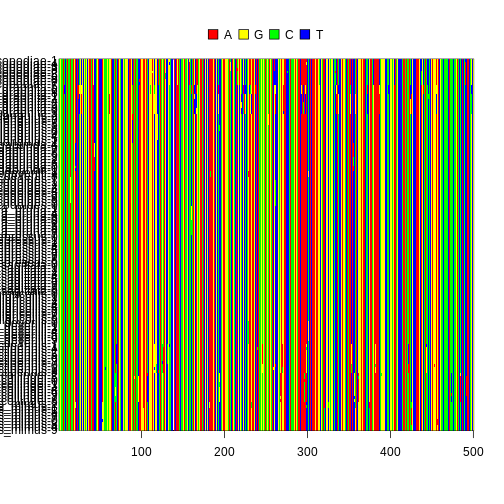

## Pop gen data

::: questions

-   What is genetic diversity?
-   What does genetic diversity say about
    community assembly?
-   What are common summaries of genetic diversity
    within species and communities?
-   What are common sequence file formats?
-   How do you read in and manipulate sequence
    data?
-   How do you visualize and summarize sequence
    data?

:::::::::::::

::: objectives

After following this episode, we intend that
participants will be able to:

1.  Understand what genetic diversity is
2.  Visualize genetic diversity distributions
3.  Connect genetic diversity distributions to
    Hill numbers
4.  Import population genetic data into the R
    environment
5.  Manipulate population genetic data
6.  Calculate genetic diversity $\pi$
7.  Calculate and interpret Hill numbers of
    genetic diversity
8.  Interpret amplicon sequence variant data and
    how it relates to data from gene alignments

:::::::::::::

# Introduction

## What is genetic diversity?

GEOBON, in their description of Essential
Biodiversity Variables, [define intraspecific
genetic
diversity](https://geobon.org/ebvs/what-are-ebvs/)
as:

> The variation in DNA sequences among individuals
> of the same species.

How is this genetic diversity generated? At a
proximal level, genetic diversity is generated
through the processes of recombination and
mutation. These two mechanisms lay the foundation
for evolutionary forces like genetic drift,
natural selection, and gene flow to shape the
distribution of genetic diversity within
populations and across communities.

Perhaps one of the most elegant theoretical
frameworks for modeling genetic diversity is
coalescent theory. Coalescent theory is a model of
how alleles sampled from a population may have
originated from a common ancestor. Under the
assumptions of no recombination, no natural
selection, no gene flow, and no population
structure, i.e. neutrality, it estimates the time
to the most recent common ancestor (TMRCA) between
two sampled alleles and the variance of this
estimate. When a population is especially large
(i.e. many breeding individuals), the TMRCA of two
randomly sampled alleles is large. This is because
the per-generation probability of two alleles
coalescing is `1 / 2Ne`, where `Ne`, the effective
population size, is the number of breeding
individuals in an idealized population that
follows the assumptions stated above. In most, if
not all, natural environments conditions are not
ideal and `Ne` does not perfectly represent the
census size of a population (see [Lewontin's
paradox](https://www.biorxiv.org/content/10.1101/2021.02.03.429633v2)).
While the relationship between `Ne` and census
population size is not perfect, in most cases `Ne`
increases as population size increases and can be
used to understand the relative sizes of
populations or size changes over time. The
intuition is best understood through
visualization.

For a population of 10 diploid individuals (20
allele copies), the probability of two randomly
sampled allele coalescing each generation is 1 /
(2 \* 10), or 1/20. In this single simulation
(conducted using [Graham Coop's
code](https://github.com/cooplab/popgen-notes/blob/master/Rcode/track_alleles.R))
, the two sampled alleles, whose genealogy is
traced in blue and red, coalesce 13 generations in
the past.


However, when the population is smaller (5
individuals, 10 allele copies), the probability of
coalescence each generation is 1 / (2 \* 5) or
1/10. In this simulation, two randomly sampled
alleles coalesce after 4 generations.


The TMRCA of the two sampled alleles corresponds
with the smaller `Ne` of this idealized
population.

Visualizing this path of ancestry as a tree would
look something like this for 5 sampled allele
copies.


Overlaying mutations on the genealogy results in
generally more mutations occurring on longer
branches, although because this is a stochastic
process, the relationship isn't always perfect
(note- this is a tree from a different simulation
to the one above).


As empirical biologists, what we have to work with
are sequence data. The accumulation of mutations
along a sequence enables us to estimate the TMRCA
of a sample of alleles, leading to an estimate of
the `Ne` of the population.

One of the simplest and most widespread estimators
of `Ne` is the average number of pairwise
differences between sequences sampled from a
population (𝞹, nucleotide diversity, [Nei and Li
1979](https://www.pnas.org/doi/abs/10.1073/pnas.76.10.5269)).
The basic idea underlying 𝞹 is that more
substitutions among a sample of sequences results
from longer branch lengths in the genealogy of the
sample, leading to a longer TMRCA and larger `Ne`.
The below figure contains the sequence alignment
related to the gene tree beside it. The average
number of pairwise nucleotide differences between
s5 and s4 is:

5 (# of nucleotide differences) / 10 (# of
basepairs in the sequence) = 0.5

The average number of pairwise nucleotide
differences between s4 and s1 is:

1 (# of nucleotide differences) / 10 (# of base
pairs in the sequence) = 0.1

The larger number of nucleotide differences
between s5 and s4 versus s4 and s1 are reflected
in the gene tree, where there the branches are
longer leading to the common ancestor of s5 and s4
versus s4 and s1. If we want the genetic diversity
of the entire sample of individuals, we add the
average pairwise number of nucleotide differences
among all of the sequences and take the average of
those values.

In this case, $\pi$ is 0.183!


Given its simplicity and ubiquity, we will cover
how to calculate the average number of pairwise
differences between sequences and summarize this
value across assemblages.

#### Resources for understanding the coalescent

-   [Graham Coop's popgen
    notes](http://cooplab.github.io/popgen-notes/)

    -   awesome resource for population genetics
        in general

-   [learnPopGen
    app](https://phytools.shinyapps.io/coalescent-plot/)

    -   visualize coalescent genealogies with
        different numbers of individuals in a
        population and different numbers of
        generations

-   [coaltrace
    app](https://bedford.io/projects/coaltrace/)

    -   a dynamic and interactive visualization of
        coalescent genealogies with the ability to
        change parameters on the fly

-   [Bedford lab
    slides](https://bedford.io/projects/phylodynamics-lecture/coalescent.html#/)

    -   a great set of slides that explains the
        coalescent in a complementary way to
        Graham Coop's notes

-   [cdmuir
    app](https://cdmuir.shinyapps.io/genetree-to-phylogeny/)

    -   uses the coalescent to simulate gene trees
        and mutations along sequences

## What does genetic diversity say about community assembly?

Under neutrality and stable demographic histories,
variation in genetic diversity across a community
reflects differences in long-term population sizes
across the community. Rather than a snapshot of
present-day abundance, this can be thought of as
an average abundance across generations.

In much the same way as a community with a few,
highly abundant species and many low abundance
species may indicate a non-neutral community
assembly process like environmental filtering, a
community that contains a few species with high
genetic diversity and many species with low
genetic diversity may indicate similar non-neutral
community assembly processes over a longer
timescale.

In addition, genetic diversity is impacted by
demographic events and natural selection.
Populations that have undergone a demographic
expansion or contraction in the recent past will
have distinct coalescent genealogies and therefore
different genetic diversities. For instance, a
population that has experienced a recent
demographic expansion will have a TMRCA more
recent than a population with the same population
size that has remained stable through the same
time period, illustrated below.


Distinguishing a small, constant-sized population
from a large population that's grown dramatically
in the recent past is difficult with single-locus
data typical of large-scale biodiversity studies.
However, when paired with other data like traits
and abundances, we can make more refined
interpretations of the shape of genetic diversity
across the community. For instance, the
interpretation of a community with a few highly
diverse species paired with many species with low
genetic diversity may reflect a community with a
few species that were not impacted by a historical
environmental disturbance alongside many species
that had their populations dramatically reduced,
but have rapidly grown to larger modern population
sizes.

::: challenge

Draw one or more possible scenarios of a pair of
coalescent genealogies drawn from a contracting
population. The size of the modern and historical
populations and the number of generations you
"simulate" are up to you, but you should draw
something similar to the figure above.

After completing this exercise, do you think a
contracting population would result in more or
less genetic diversity?

::: solution

Contracting populations are funny! If a
contraction was recent, the population may
maintain the levels of genetic diversity it had
before the contraction. However, if the
contraction happened in the more distant past and
was maintained, genetic diversity is reduced.


:::

:::

### Hill numbers of genetic diversity across species

In the context of summarizing species abundances,
Hill numbers are the effective number of species
in a community, where each exponent (q-value)
increasingly weights common species more heavily.
The interpretation is similar when summarizing
genetic diversity. Hill numbers are the effective
number of species in a community, where each
q-value increasingly weights species with lower
genetic diversity more heavily. Rather than
measuring an effective diversity of abundances,
this is an effective diversity of genetic
diversities.


# Work with pop gen data

The three packages we're working with are `msa`,
`ape`, and `hillR`. The first two are used to work
with sequencing data, while `hillR` is what we
will use to calculate Hill numbers. I'll provide
more explanation once we get to using them.


```r
library(msa)
library(ape)
library(hillR)
```

## Sequences

### FASTA

A FASTA file contains one or more DNA sequences,
where the DNA sequence is preceded by a line with
a carat ("&gt;") followed by an unique sequence
ID:

```         
>seq0010
GATCCCCAATTGGGG
```

This is perhaps the most common way to store
sequence information as it is simple and has
historical inertia. For more information, see the
[the NCBI
page](https://www.ncbi.nlm.nih.gov/genbank/fastaformat/#:~:text=In%20FASTA%20format%20the%20line,should%20not%20contain%20any%20spaces.).

### Alignment

Prior to analysis, sequence data must be aligned
if they haven't been already. A sequence alignment
is necessary to identify regions of DNA that are
similar or that vary. There are [many pieces of
software to perform
alignments](https://en.wikipedia.org/wiki/List_of_sequence_alignment_software)
and all have their advantages and disadvantages,
but we will choose a single program, [Clustal
Omega](https://www.ebi.ac.uk/Tools/msa/clustalo/),
which is fast and robust for short sequence
alignments. While Clustal Omega can be run from
the command line, we will use the R package
[msa](https://bioconductor.org/packages/release/bioc/html/msa.html)
to keep everything in the R environment.

First, a FASTA file containing the sequences needs
to be read in using the `readDNAStringSet()`
function. For most of this episode, we will be
working with sequences from the Kauai island. At
the end, we will summarize the


```r
seq_path <- "https://raw.githubusercontent.com/role-model/multidim-biodiv-data/main/episodes/data/kauai_seqs.fas"

seqs <- readDNAStringSet(seq_path)

seqs
```

```{.output}
DNAStringSet object of length 130:
      width seq                                             names               
  [1]   500 CGCGCACTCTACCACCCAGACT...TGACTCCTATCGTTAATTCGTG Proterhinus_punct...
  [2]   500 CGCGCACTCTACCACCCAGACT...TGACTCCTATCGTTAATTCGTG Proterhinus_punct...
  [3]   500 CGCGCACTCTACCACCCAGACT...TGACTCCTATCGTTAATTCGTG Proterhinus_punct...
  [4]   500 CGCGCACTCTACCACCCAGACT...TGACTCCTATCGTTAATTCGTG Proterhinus_punct...
  [5]   500 CGCGCACTCTACCACCCAGACT...TGACTCCTATCGTTAATTCGTG Proterhinus_punct...
  ...   ... ...
[126]   500 CGCGCACTCTACCACCCAGACT...TGACTCCTATCGTTAATTCGTG Campsicnemus_nigr...
[127]   500 CGCGCACTCTACCACCCAGACT...TGACTCCTATCGTTAATTCGTG Campsicnemus_nigr...
[128]   500 CGCGCACTCTACCACCCAGACT...TGACTCCTATCGTTAATTCGTG Campsicnemus_nigr...
[129]   500 CGCGCACTCTACCACCCAGACT...TGACTCCTATCGTTAATTCGTG Campsicnemus_nigr...
[130]   500 CGCGCACTCTACCACCCAGACT...TGACTCCTATCGTTAATTCGTG Campsicnemus_nigr...
```

To align the sequences using Clustal Omega, we use
the `msa` function and specify the `method` as
"ClustalOmega". There are more arguments that you
can use to fine-tune the alignment, but these are
not necessary for the vast majority of scenarios.


```r
alignment <- msa(seqs, method = "ClustalOmega")
```

```{.output}
using Gonnet
```

```r
alignment
```

```{.output}
ClustalOmega 1.2.0 

Call:
   msa(seqs, method = "ClustalOmega")

MsaDNAMultipleAlignment with 130 rows and 500 columns
      aln                                                  names
  [1] CGCGCACTCTACCACCCAGACTATC...CCGGACTCCTATCGATAATTCGTG Eudonia_lycopodiae-6
  [2] CGCGCACTCTACCACCCAGACTATC...CCCGACTCCTATCGTTAATTCGTG Eudonia_lycopodiae-1
  [3] CGCGCACTCTACCACCCAGACTATC...CCCGACTCCTATCGATAATTCGTG Eudonia_lycopodiae-4
  [4] CGCGCACTCTACCACCCAGACTATC...CCCGACTCCTATCGATAATTCGTG Eudonia_lycopodiae-3
  [5] CGCGCACTCTACCACCCAGACTATC...CCCGACTCCTATCGATAATTCGTG Eudonia_lycopodiae-8
  [6] CGCGCACTCTACCACCCAGACTATC...CCCGACTCCTATCGATAATTCGTG Eudonia_lycopodiae-2
  [7] CGCGCACTCTACCACCCAGACTATC...CCCGACTCCTATCGATAATTCGTG Eudonia_lycopodiae-5
  [8] CGCGCACTCTACCACCCAGACTATC...CCCGACTCCTATCGATAATTCGTG Eudonia_lycopodiae-9
  [9] CGCGCACTCTACCACCCAGACTATC...CCCGACTCCTATCGATAATTCGTG Eudonia_lycopodiae-0 
  ... ...
[123] CGCGCACTCTACCACCCAGACTATC...CCTGACTCCTATCGTTAATTCGTG Metrothorax_dever...
[124] CGCGCACTCTACCACCCAGACTATC...CCTGACTCCTATCGTTAATTCGTG Metrothorax_dever...
[125] CGCGCACTCTACCACCCAGACTATC...CCTGACTCCTATCGTTAATTCGTG Metrothorax_dever...
[126] CGCGCACTCTACCACCCAGACTATC...CCTGACTCCTATCGTTAATTCGTG Metrothorax_dever...
[127] CGCGCACTCTACCACCCAGACTATC...CCTGACTCCTATCGTTAATTCGTG Metrothorax_dever...
[128] CGCGCACTCTACCACCCAGACTATC...CCTGACTCCTATCGTTAATTCGTG Metrothorax_dever...
[129] CGCGCACTCTACCACCCAGACTATC...CCTGACTCCTATCGTTAATTCGTG Metrothorax_dever...
[130] CGCGCACTCTACCACCCAGACTATC...CCTGACTCCTATCGTTAATTCGTG Metrothorax_dever...
  Con CGCGCACTCTACCACCCAGACTATC...CCTGACTCCTATCGTTAATTCGTG Consensus 
```

If after you perform your alignment you find that
one or more individuals do not belong or are
negatively impacting the alignment, you have to
manipulate your unaligned sequence data and then
re-align the sequences. For instance, say you
didn't want to include the individual `ind_name`
in the alignment. First, remove the individual
from the `seqs` object.


```r
# remove individual
seqs_filt <- seqs[names(seqs) != "Eudonia_lycopodiae-6"]

seqs_filt
```

```{.output}
DNAStringSet object of length 129:
      width seq                                             names               
  [1]   500 CGCGCACTCTACCACCCAGACT...TGACTCCTATCGTTAATTCGTG Proterhinus_punct...
  [2]   500 CGCGCACTCTACCACCCAGACT...TGACTCCTATCGTTAATTCGTG Proterhinus_punct...
  [3]   500 CGCGCACTCTACCACCCAGACT...TGACTCCTATCGTTAATTCGTG Proterhinus_punct...
  [4]   500 CGCGCACTCTACCACCCAGACT...TGACTCCTATCGTTAATTCGTG Proterhinus_punct...
  [5]   500 CGCGCACTCTACCACCCAGACT...TGACTCCTATCGTTAATTCGTG Proterhinus_punct...
  ...   ... ...
[125]   500 CGCGCACTCTACCACCCAGACT...TGACTCCTATCGTTAATTCGTG Campsicnemus_nigr...
[126]   500 CGCGCACTCTACCACCCAGACT...TGACTCCTATCGTTAATTCGTG Campsicnemus_nigr...
[127]   500 CGCGCACTCTACCACCCAGACT...TGACTCCTATCGTTAATTCGTG Campsicnemus_nigr...
[128]   500 CGCGCACTCTACCACCCAGACT...TGACTCCTATCGTTAATTCGTG Campsicnemus_nigr...
[129]   500 CGCGCACTCTACCACCCAGACT...TGACTCCTATCGTTAATTCGTG Campsicnemus_nigr...
```

As a reminder, `!=` means "does not equal", so
`names(seqs) != "Eudonia_lycopodiae-6"` returns
`TRUE` when the sequence name does not match
"Eudonia_lycopodiae-6".

Following the filtering, you need to realign the
new set of sequences.


```r
alignment <- msa(seqs_filt, method = "ClustalOmega")
```

```{.output}
using Gonnet
```

```r
alignment
```

```{.output}
ClustalOmega 1.2.0 

Call:
   msa(seqs_filt, method = "ClustalOmega")

MsaDNAMultipleAlignment with 129 rows and 500 columns
      aln                                                  names
  [1] CGCGCACTCTACCACCCAGACTATC...CCCGACTCCTATCGTTAATTCGTG Eudonia_lycopodiae-1
  [2] CGCGCACTCTACCACCCAGACTATC...CCCGACTCCTATCGATAATTCGTG Eudonia_lycopodiae-4
  [3] CGCGCACTCTACCACCCAGACTATC...CCCGACTCCTATCGATAATTCGTG Eudonia_lycopodiae-3
  [4] CGCGCACTCTACCACCCAGACTATC...CCCGACTCCTATCGATAATTCGTG Eudonia_lycopodiae-8
  [5] CGCGCACTCTACCACCCAGACTATC...CCCGACTCCTATCGATAATTCGTG Eudonia_lycopodiae-2
  [6] CGCGCACTCTACCACCCAGACTATC...CCCGACTCCTATCGATAATTCGTG Eudonia_lycopodiae-5
  [7] CGCGCACTCTACCACCCAGACTATC...CCCGACTCCTATCGATAATTCGTG Eudonia_lycopodiae-9
  [8] CGCGCACTCTACCACCCAGACTATC...CCCGACTCCTATCGATAATTCGTG Eudonia_lycopodiae-0
  [9] CGCGCACTCTACCACCCAGACTATC...CCCGACTCCTATCGATAATTCGTG Eudonia_lycopodiae-7 
  ... ...
[122] CGCGCACTCTACCACCCAGACTATC...CCTGACTCCTATCGTTAATTCGTG Nesodynerus_mimus-1
[123] CGCGCACTCTACCACCCAGACTATC...CCTGACTCCTATCGTTAATTCGTG Nesodynerus_mimus-5
[124] CGCGCACTCTACCACCCAGACTATC...CCTGACTCCTATCGTTAATTCGTG Nesodynerus_mimus-6
[125] CGCGCACTCTACCACCCAGACTATC...CCTGACTCCTATCGTTAATTCGTG Nesodynerus_mimus-7
[126] CGCGCACTCTACCACCCAGACTATC...CCTGACTCCTATCGTTAATTCGTG Nesodynerus_mimus-0
[127] CGCGCACTCTACCACCCAGACTATC...CCTGACTCCTATCGTTAATTCGTG Nesodynerus_mimus-8
[128] CGCGCACTCTACCACCCAGACTATC...CCTGACTCCTATCGTTAATTCGTG Nesodynerus_mimus-4
[129] CGCGCACTCTACCACCCAGACTATC...CCTGACTCCTATCGTTAATTCGTG Nesodynerus_mimus-9
  Con CGCGCACTCTACCACCCAGACTATC...CCTGACTCCTATCGTTAATTCGTG Consensus 
```

There are quite a few packages in R to work with
sequence data, for example
[seqinr](https://cran.r-project.org/web/packages/seqinr/index.html),
[phangorn](https://cran.r-project.org/web/packages/phangorn/vignettes/Trees.html),
and
[ape](https://cran.r-project.org/web/packages/ape/index.html).
`ape` is the most versatile of these. But before
we can use `ape`, the alignment must be converted
to the `ape::DNAbin` format.


```r
ape_align <- msaConvert(alignment, type = "ape::DNAbin")

ape_align
```

```{.output}
129 DNA sequences in binary format stored in a matrix.

All sequences of same length: 500 

Labels:
Eudonia_lycopodiae-1
Eudonia_lycopodiae-4
Eudonia_lycopodiae-3
Eudonia_lycopodiae-8
Eudonia_lycopodiae-2
Eudonia_lycopodiae-5
...

Base composition:
    a     c     g     t 
0.260 0.245 0.234 0.261 
(Total: 64.5 kb)
```

Although not necessary for this workshop (the
sequence data is already aligned), it's generally
advisable to write your DNA alignment to a new
file to use later or with other programs.


```r
ape::write.FASTA(ape_align, "seqs_aligned.fas")
```

::: challenge 
This FASTA file contains multiple
species. However, you may only want to align and
analyze a single species for your analysis. Using
what you learned about the `%in%` operator in the
Phylogenetics episode, filter your `seqs` object
to only contain sequences for *Hyposmocoma
sagittata*.

::: solution


```r
# you can also make a vector with the c() function and list each individual separately, but this requires a little less typing
hypo_inds <- paste0("Hyposmocoma_sagittata-", 0:9)

seqs_hypo <- seqs[names(seqs) %in% hypo_inds]

seqs_hypo
```

```{.output}
DNAStringSet object of length 10:
     width seq                                              names               
 [1]   500 CGCGCACTCTACCACCCAGACTA...TGACTCCTATCGTTAATTCGTG Hyposmocoma_sagit...
 [2]   500 CGCGCACTCTACCACCCAGACTA...TGACTCCTATCGTTAATTCGTG Hyposmocoma_sagit...
 [3]   500 CGCGCACTCTACCACCCAGACTA...TGACTCCTATCGTTAATTCGTG Hyposmocoma_sagit...
 [4]   500 CGCGCACTCTACCACCCAGACTA...TGACTCCTATCGTTAATTCGTG Hyposmocoma_sagit...
 [5]   500 CGCGCACTCTACCACCCAGACTA...TGACTCCTATCGTTAATTCGTG Hyposmocoma_sagit...
 [6]   500 CGCGCACTCTACCACCCAGACTA...TGACTCCTATCGTTAATTCGTG Hyposmocoma_sagit...
 [7]   500 CGCGCACTCTACCACCCAGACTA...TGACTCCTATCGTTAATTCGTG Hyposmocoma_sagit...
 [8]   500 CGCGCACTCTACCACCCAGACTA...TGACTCCTATCGTTAATTCGTG Hyposmocoma_sagit...
 [9]   500 CGCGCACTCTACCACCCAGACTA...TGACTCCTATCGTTAATTCGTG Hyposmocoma_sagit...
[10]   500 CGCGCACTCTACCACCCAGACTA...TGACTCCTATCGTTAATTCGTG Hyposmocoma_sagit...
```

:::

:::

### ape

#### Check alignment

`ape` has a useful utility that allows you perform
a series of diagnostics on your alignment to make
sure nothing is fishy. The function can output
multiple plots, but let's just visualize the
alignment plot. If the colors seem jumbled in a
region, this indicates that an alignment error may
have occurred and to inspect your sequences for
any problems.

In addition, the function outputs a series of
helpful statistics to your console. Ideally, your
alignment should have few gaps and a number of
segregating sites that is reasonable for the
number of sites in your alignment and the
evolutionary divergence of the sequences included
in the alignment, e.g., for an alignment with 970
sites of a single bird species, around 40
segregating sites is reasonable, but 200
segregating sites may indicate that something went
wrong with your alignment or a species was
misidentified. In addition, for diploid species a
vast majority, if not all of the sites should
contain one or two observed bases.


```r
checkAlignment(ape_align, what = 1)
```

```{.output}

Number of sequences: 129 
Number of sites: 500 

No gap in alignment.

Number of segregating sites (including gaps): 126
Number of sites with at least one substitution: 126
Number of sites with 1, 2, 3 or 4 observed bases:
  1   2   3   4 
374  66  56   4 
```



#### Calculate genetic diversity

To calculate genetic diversity for each species,
it's easiest to split the alignment by species
before calculating the average number of pairwise
nucleotide differences. Since we're not concerned
about alignment quality, we can just split the
alignment, rather than splitting the original
`msa` sequence object and re-aligning.

First, you need to get the names of the species.
Thankfully, the genus and species is included in
the sequences names, where the format is
"Genus_species-number". To get the species names,
you need to use the `gsub()` function, which
replaces all of the occurrences of a particular
string pattern in a string. In our case, we need
to remove the "-number" individual identifier at
the end of the sequence name, so we only have
"Genus_species". We will use a short regular
expression, or
[regex](https://r4ds.had.co.nz/strings.html),
which is a sequence of characters that specifies a
pattern that a string search algorithm like
`gsub()` will search for.

The pattern `"-[0-9]"` means "match any pattern in
the string that is a dash followed by any
occurrence of a digit". The hard brackets `[ ]`
specify a character set, where any occurrence of
the characters inside the brackets will be
matched. In this case, we specify zero through
nine, so any digits that follow a dash will be
matched. The second argument contains the string
to replace the pattern with. We want to remove the
pattern, so we supply an empty string to be
replaced.

Following the string removal, we only want unique
instances of the species names, so we use the
`unique()` function to retain unique species
names.


```r
sp_names <- gsub("-[0-9]", "", names(seqs))

sp_names <- unique(sp_names)

sp_names
```

```{.output}
 [1] "Proterhinus_punctipennis" "Xyletobius_collingei"    
 [3] "Metrothorax_deverilli"    "Nesodynerus_mimus"       
 [5] "Scaptomyza_vagabunda"     "Lucilia_graphita"        
 [7] "Eudonia_lycopodiae"       "Atelothrus_depressus"    
 [9] "Mecyclothorax_longulus"   "Laupala_pruna"           
[11] "Hylaeus_sphecodoides"     "Hyposmocoma_sagittata"   
[13] "Campsicnemus_nigricollis"
```

Next, we are going to build an R function
line-by-line to facilitate creating a list of
species alignments. User-defined functions are
very useful for when you want to complete a set of
tasks repeatedly. Copy-pasting chunks of code and
changing things slightly for each situation can
lead to errors, headaches, and general pain. The
worst bit of pain is when you need to change
something in that chunk of code and you have to go
back and change it for every instance you
copy-pasted it before! When you have a function,
you only need to change the code once. I'll go
through each line of code, then we'll wrap up the
code in a function.

First, we need to turn the `ape` alignment into a
list because the original `DNAbin` object doesn't
allow subsetting.


```r
align_list <- as.list(ape_align)
```

The `grepl()` function searches for a string
pattern in the text, then returns `TRUE` if it
finds it and `FALSE` if it doesn't. We'll use the
resulting boolean (`TRUE/FALSE`) vector to extract
the species from the alignment. Here is an example
with *Proterhinus punctipennis*. You'll see the
100-110 slots are `TRUE`, indicating that those
are the locations in the alignment that contain
*P. punctipennis* sequences.


```r
sp_boolean <- grepl("Proterhinus_punctipennis", names(align_list), fixed = TRUE)

sp_boolean
```

```{.output}
  [1] FALSE FALSE FALSE FALSE FALSE FALSE FALSE FALSE FALSE FALSE FALSE FALSE
 [13] FALSE FALSE FALSE FALSE FALSE FALSE FALSE FALSE FALSE FALSE FALSE FALSE
 [25] FALSE FALSE FALSE FALSE FALSE FALSE FALSE FALSE FALSE FALSE FALSE FALSE
 [37] FALSE FALSE FALSE FALSE FALSE FALSE FALSE FALSE FALSE FALSE FALSE FALSE
 [49] FALSE FALSE FALSE FALSE FALSE FALSE FALSE FALSE FALSE FALSE FALSE FALSE
 [61] FALSE FALSE FALSE FALSE FALSE FALSE FALSE FALSE FALSE FALSE FALSE FALSE
 [73] FALSE FALSE FALSE FALSE FALSE FALSE FALSE FALSE FALSE FALSE FALSE FALSE
 [85] FALSE FALSE FALSE FALSE FALSE FALSE FALSE FALSE FALSE FALSE FALSE FALSE
 [97] FALSE FALSE FALSE  TRUE  TRUE  TRUE  TRUE  TRUE  TRUE  TRUE  TRUE  TRUE
[109]  TRUE FALSE FALSE FALSE FALSE FALSE FALSE FALSE FALSE FALSE FALSE FALSE
[121] FALSE FALSE FALSE FALSE FALSE FALSE FALSE FALSE FALSE
```

Following the conversion, we use bracket indexing
to subset the alignment by the `sp_boolean`
boolean vector. Now we have an alignment of only
*Proterhinus punctipennis* sequences!


```r
align_sp <- align_list[sp_boolean]

align_sp
```

```{.output}
10 DNA sequences in binary format stored in a list.

All sequences of same length: 500 

Labels:
Proterhinus_punctipennis-1
Proterhinus_punctipennis-4
Proterhinus_punctipennis-2
Proterhinus_punctipennis-5
Proterhinus_punctipennis-6
Proterhinus_punctipennis-9
...

Base composition:
    a     c     g     t 
0.262 0.242 0.237 0.259 
(Total: 5 kb)
```

Now, we need to wrap these bits of code into a
function so we can create separate alignments for
all species. The structure of a function looks
like this.


```r
do_something <- function(x, y) {
    
}
```

`function()` defines the `do_something` object as
a function, while `x` and `y` are the arguments
you are supplying to the function. The curly
brackets `{ }` contain the code you want to run in
the function.

For our function `split_align`, we need two
arguments- the species name we want to extract
from the alignment (`spname`) and the alignment
itself (`alignment`). We then add our code inside
the curly brackets `{ }`, replacing
`"Proterhinus_punctipennis"` with `spname` and
`ape_align` with `alignment`. At the end, we
specify that we want to return the `align_sp`
object with the `return()` function. Although not
always necessary, using the `return()` function is
generally good practice for code readability.


```r
split_align <- function(spname, alignment) {
    # convert ape object to list
    align_list <- as.list(alignment)
    
    # get boolean vector for species
    sp_boolean <- grepl(spname, names(align_list), fixed = TRUE)
    
    # subset alignment for species
    align_sp <- align_list[sp_boolean]
    
    # return the alignment
    return(align_sp)
}
```

Now we can check that the function works by
running it on *Proterhinus punctipennis*. It does!
(or it should).


```r
split_align(spname = "Proterhinus_punctipennis", alignment = ape_align)
```

```{.output}
10 DNA sequences in binary format stored in a list.

All sequences of same length: 500 

Labels:
Proterhinus_punctipennis-1
Proterhinus_punctipennis-4
Proterhinus_punctipennis-2
Proterhinus_punctipennis-5
Proterhinus_punctipennis-6
Proterhinus_punctipennis-9
...

Base composition:
    a     c     g     t 
0.262 0.242 0.237 0.259 
(Total: 5 kb)
```

If your code throws an error or the output isn't
what you expect, you can place the `browser()`
function at a particular line in your code to
enable you to run it line by line. This helps for
diagnosing where exactly something went wrong.


```r
split_align <- function(spname, alignment) {
    browser()
    # convert ape object to list
    align_list <- as.list(alignment)
    
    # get boolean vector for species
    sp_boolean <- grepl(spname, names(align_list), fixed = TRUE)
    
    # subset alignment for species
    align_sp <- align_list[sp_boolean]
    
    # return the alignment
    return(align_sp)
}
```

Now to apply our function to the vector of species
names! We're using the `lapply()` function to
apply the `split_seqs` function to every element
in `sp_names` and return a list. `lapply()`
automatically populates the first argument in the
function with the vector or list you supply it,
but you can supply further arguments after
entering your function. So, after adding
`split_seqs`, we specify `alignment = ape_align`.

For good measure, we'll also specify the names of
the list elements as the species names, so they're
easy to access later.


```r
align_split <- lapply(sp_names, split_align, alignment = ape_align)

names(align_split) <- sp_names

align_split
```

```{.output}
$Proterhinus_punctipennis
10 DNA sequences in binary format stored in a list.

All sequences of same length: 500 

Labels:
Proterhinus_punctipennis-1
Proterhinus_punctipennis-4
Proterhinus_punctipennis-2
Proterhinus_punctipennis-5
Proterhinus_punctipennis-6
Proterhinus_punctipennis-9
...

Base composition:
    a     c     g     t 
0.262 0.242 0.237 0.259 
(Total: 5 kb)

$Xyletobius_collingei
10 DNA sequences in binary format stored in a list.

All sequences of same length: 500 

Labels:
Xyletobius_collingei-2
Xyletobius_collingei-5
Xyletobius_collingei-0
Xyletobius_collingei-1
Xyletobius_collingei-3
Xyletobius_collingei-4
...

Base composition:
    a     c     g     t 
0.262 0.244 0.236 0.259 
(Total: 5 kb)

$Metrothorax_deverilli
10 DNA sequences in binary format stored in a list.

All sequences of same length: 500 

Labels:
Metrothorax_deverilli-2
Metrothorax_deverilli-8
Metrothorax_deverilli-0
Metrothorax_deverilli-1
Metrothorax_deverilli-3
Metrothorax_deverilli-4
...

Base composition:
    a     c     g     t 
0.260 0.246 0.232 0.262 
(Total: 5 kb)

$Nesodynerus_mimus
10 DNA sequences in binary format stored in a list.

All sequences of same length: 500 

Labels:
Nesodynerus_mimus-2
Nesodynerus_mimus-3
Nesodynerus_mimus-1
Nesodynerus_mimus-5
Nesodynerus_mimus-6
Nesodynerus_mimus-7
...

Base composition:
    a     c     g     t 
0.254 0.247 0.237 0.262 
(Total: 5 kb)

$Scaptomyza_vagabunda
10 DNA sequences in binary format stored in a list.

All sequences of same length: 500 

Labels:
Scaptomyza_vagabunda-4
Scaptomyza_vagabunda-6
Scaptomyza_vagabunda-7
Scaptomyza_vagabunda-8
Scaptomyza_vagabunda-9
Scaptomyza_vagabunda-2
...

Base composition:
    a     c     g     t 
0.260 0.247 0.233 0.260 
(Total: 5 kb)

$Lucilia_graphita
10 DNA sequences in binary format stored in a list.

All sequences of same length: 500 

Labels:
Lucilia_graphita-5
Lucilia_graphita-6
Lucilia_graphita-8
Lucilia_graphita-1
Lucilia_graphita-7
Lucilia_graphita-4
...

Base composition:
    a     c     g     t 
0.262 0.240 0.237 0.261 
(Total: 5 kb)

$Eudonia_lycopodiae
9 DNA sequences in binary format stored in a list.

All sequences of same length: 500 

Labels:
Eudonia_lycopodiae-1
Eudonia_lycopodiae-4
Eudonia_lycopodiae-3
Eudonia_lycopodiae-8
Eudonia_lycopodiae-2
Eudonia_lycopodiae-5
...

Base composition:
    a     c     g     t 
0.258 0.248 0.231 0.262 
(Total: 4.5 kb)

$Atelothrus_depressus
10 DNA sequences in binary format stored in a list.

All sequences of same length: 500 

Labels:
Atelothrus_depressus-0
Atelothrus_depressus-1
Atelothrus_depressus-2
Atelothrus_depressus-3
Atelothrus_depressus-4
Atelothrus_depressus-5
...

Base composition:
    a     c     g     t 
0.260 0.246 0.232 0.262 
(Total: 5 kb)

$Mecyclothorax_longulus
10 DNA sequences in binary format stored in a list.

All sequences of same length: 500 

Labels:
Mecyclothorax_longulus-2
Mecyclothorax_longulus-9
Mecyclothorax_longulus-7
Mecyclothorax_longulus-8
Mecyclothorax_longulus-3
Mecyclothorax_longulus-6
...

Base composition:
    a     c     g     t 
0.260 0.244 0.235 0.261 
(Total: 5 kb)

$Laupala_pruna
10 DNA sequences in binary format stored in a list.

All sequences of same length: 500 

Labels:
Laupala_pruna-1
Laupala_pruna-2
Laupala_pruna-4
Laupala_pruna-8
Laupala_pruna-9
Laupala_pruna-0
...

Base composition:
    a     c     g     t 
0.260 0.247 0.233 0.260 
(Total: 5 kb)

$Hylaeus_sphecodoides
10 DNA sequences in binary format stored in a list.

All sequences of same length: 500 

Labels:
Hylaeus_sphecodoides-7
Hylaeus_sphecodoides-1
Hylaeus_sphecodoides-2
Hylaeus_sphecodoides-3
Hylaeus_sphecodoides-4
Hylaeus_sphecodoides-5
...

Base composition:
    a     c     g     t 
0.258 0.248 0.234 0.260 
(Total: 5 kb)

$Hyposmocoma_sagittata
10 DNA sequences in binary format stored in a list.

All sequences of same length: 500 

Labels:
Hyposmocoma_sagittata-0
Hyposmocoma_sagittata-1
Hyposmocoma_sagittata-2
Hyposmocoma_sagittata-3
Hyposmocoma_sagittata-4
Hyposmocoma_sagittata-5
...

Base composition:
    a     c     g     t 
0.260 0.246 0.232 0.262 
(Total: 5 kb)

$Campsicnemus_nigricollis
10 DNA sequences in binary format stored in a list.

All sequences of same length: 500 

Labels:
Campsicnemus_nigricollis-0
Campsicnemus_nigricollis-1
Campsicnemus_nigricollis-2
Campsicnemus_nigricollis-3
Campsicnemus_nigricollis-4
Campsicnemus_nigricollis-5
...

Base composition:
    a     c     g     t 
0.260 0.246 0.232 0.262 
(Total: 5 kb)
```

Now we're going to calculate the average number of
pairwise genetic differences among these
sequences. `ape` has the `dist.dna()` function to
calculate various genetic distance metrics for an
alignment.

You use the argument `model = "raw"` to specify
that you want to use the average number of
pairwise differences as your metric. When
calculating the number of pairwise genetic
differences, you have to choose whether you want
missing data to be deleted across the entire
alignment (`pairwise.deletion = FALSE`) or only
between the two sequences being compared
(`pairwise.deletion = TRUE`). Since we want to
take advantage of as much data as possible when
computing 𝜋, we'll set `pairwise.deletion = TRUE`.

We'll do this for a single species, then you'll
get a chance to write your own function to do it
across species!


```r
fas_gendist <- dist.dna(align_split$Proterhinus_punctipennis, model = "raw", pairwise.deletion = TRUE)

fas_gendist
```

```{.output}
                           Proterhinus_punctipennis-1
Proterhinus_punctipennis-4                      0.010
Proterhinus_punctipennis-2                      0.006
Proterhinus_punctipennis-5                      0.006
Proterhinus_punctipennis-6                      0.006
Proterhinus_punctipennis-9                      0.006
Proterhinus_punctipennis-7                      0.008
Proterhinus_punctipennis-0                      0.026
Proterhinus_punctipennis-3                      0.028
Proterhinus_punctipennis-8                      0.024
                           Proterhinus_punctipennis-4
Proterhinus_punctipennis-4                           
Proterhinus_punctipennis-2                      0.004
Proterhinus_punctipennis-5                      0.004
Proterhinus_punctipennis-6                      0.004
Proterhinus_punctipennis-9                      0.004
Proterhinus_punctipennis-7                      0.006
Proterhinus_punctipennis-0                      0.024
Proterhinus_punctipennis-3                      0.026
Proterhinus_punctipennis-8                      0.022
                           Proterhinus_punctipennis-2
Proterhinus_punctipennis-4                           
Proterhinus_punctipennis-2                           
Proterhinus_punctipennis-5                      0.000
Proterhinus_punctipennis-6                      0.000
Proterhinus_punctipennis-9                      0.000
Proterhinus_punctipennis-7                      0.002
Proterhinus_punctipennis-0                      0.020
Proterhinus_punctipennis-3                      0.022
Proterhinus_punctipennis-8                      0.018
                           Proterhinus_punctipennis-5
Proterhinus_punctipennis-4                           
Proterhinus_punctipennis-2                           
Proterhinus_punctipennis-5                           
Proterhinus_punctipennis-6                      0.000
Proterhinus_punctipennis-9                      0.000
Proterhinus_punctipennis-7                      0.002
Proterhinus_punctipennis-0                      0.020
Proterhinus_punctipennis-3                      0.022
Proterhinus_punctipennis-8                      0.018
                           Proterhinus_punctipennis-6
Proterhinus_punctipennis-4                           
Proterhinus_punctipennis-2                           
Proterhinus_punctipennis-5                           
Proterhinus_punctipennis-6                           
Proterhinus_punctipennis-9                      0.000
Proterhinus_punctipennis-7                      0.002
Proterhinus_punctipennis-0                      0.020
Proterhinus_punctipennis-3                      0.022
Proterhinus_punctipennis-8                      0.018
                           Proterhinus_punctipennis-9
Proterhinus_punctipennis-4                           
Proterhinus_punctipennis-2                           
Proterhinus_punctipennis-5                           
Proterhinus_punctipennis-6                           
Proterhinus_punctipennis-9                           
Proterhinus_punctipennis-7                      0.002
Proterhinus_punctipennis-0                      0.020
Proterhinus_punctipennis-3                      0.022
Proterhinus_punctipennis-8                      0.018
                           Proterhinus_punctipennis-7
Proterhinus_punctipennis-4                           
Proterhinus_punctipennis-2                           
Proterhinus_punctipennis-5                           
Proterhinus_punctipennis-6                           
Proterhinus_punctipennis-9                           
Proterhinus_punctipennis-7                           
Proterhinus_punctipennis-0                      0.022
Proterhinus_punctipennis-3                      0.024
Proterhinus_punctipennis-8                      0.020
                           Proterhinus_punctipennis-0
Proterhinus_punctipennis-4                           
Proterhinus_punctipennis-2                           
Proterhinus_punctipennis-5                           
Proterhinus_punctipennis-6                           
Proterhinus_punctipennis-9                           
Proterhinus_punctipennis-7                           
Proterhinus_punctipennis-0                           
Proterhinus_punctipennis-3                      0.014
Proterhinus_punctipennis-8                      0.010
                           Proterhinus_punctipennis-3
Proterhinus_punctipennis-4                           
Proterhinus_punctipennis-2                           
Proterhinus_punctipennis-5                           
Proterhinus_punctipennis-6                           
Proterhinus_punctipennis-9                           
Proterhinus_punctipennis-7                           
Proterhinus_punctipennis-0                           
Proterhinus_punctipennis-3                           
Proterhinus_punctipennis-8                      0.008
```

The function returns a distance matrix containing
the pairwise differences among all sequences in
the data set. To take a quick peak at their
distribution, we can use the `hist()` function on
the distance matrix.


```r
hist(fas_gendist)
```


Since we want the average of these differences, we
need to take their average. However, you may have
noticed the distribution of genetic distances is
non-normal, with mostly low genetic diversities.
This is the case with most genetic data sets. So,
instead of taking the mean, the `median()` will
provide a better estimate of the center of the
distribution. The average number of pairwise
genetic differences, aka 𝜋, aka genetic diversity
of *Proterhinus punctipennis* is 0.01!


```r
fas_gendiv <- median(fas_gendist)

fas_gendiv
```

```{.output}
[1] 0.01
```

::: challenge

Write your own function to calculate 𝜋 for each of
the alignments! After writing the function, try
applying the function to every alignment in
`align_split`.

::: solution


```r
calc_pi <- function(alignment) {
    # get genetic distances
    dists <- dist.dna(alignment, model = "raw", pairwise.deletion = TRUE)
    # get average
    pi <- median(dists)
    
    return(pi)
}
```

I haven't introduced it yet, but `sapply()` is
similar to `lapply()`, except it returns a vector
instead of a list. It saves an extra step when you
know your function is returning single values of
the same type.


```r
# solution 1. This returns a vector
pi_across_sp <- sapply(align_split, calc_pi)

# solution 2
pi_across_sp <- lapply(align_split, calc_pi)
## convert to a vector
pi_across_sp <- unlist(pi_across_sp)
```

:::

:::

Let's plot the ranked genetic diversities of
Kauai! We'll use plotting techniques similar to
what you've used in the Abundance and Traits
episodes.


```r
plot(sort(pi_across_sp, decreasing = TRUE), xlab = "Rank", ylab = "Genetic diversity")
```


### Hill numbers

Now, let's calculate the first five Hill numbers
(q = 1-5) of this distribution. For this, we will
use the `hillR` package. `hillR` does not have a
function specifically for calculating Hill numbers
from genetic diversities, but the function you
have used for calculating Hill numbers from
abundances, `hill_taxa` will work the same.

To turn your vector of genetic diversities into a
site by species matrix, you just need to transpose
`pi_across_sp` with the `t()` function. This turns
`pi_across_sp` into a matrix with a column for
each species and a row for each site, which in
this case is 1.


```r
pi_t <- t(pi_across_sp)
pi_t
```

```{.output}
     Proterhinus_punctipennis Xyletobius_collingei Metrothorax_deverilli
[1,]                     0.01                0.006                 0.002
     Nesodynerus_mimus Scaptomyza_vagabunda Lucilia_graphita Eudonia_lycopodiae
[1,]             0.004                0.004            0.016              0.012
     Atelothrus_depressus Mecyclothorax_longulus Laupala_pruna
[1,]                    0                  0.002         0.002
     Hylaeus_sphecodoides Hyposmocoma_sagittata Campsicnemus_nigricollis
[1,]                    0                     0                        0
```

Finally, you can feed this matrix into
`hill_taxa()` for each q value we're interested
in. To make this efficient, let's use `sapply()`!


```r
hill_pi <- sapply(1:5, hill_taxa, comm = pi_t)
```

A quick barplot shows what we expect- Hill
decreases with increasing q because it is
increasingly weighted by low genetic diversities.


```r
barplot(hill_pi, names.arg = c("q=1", "q=2", "q=3", "q=4", "q=5"), ylab = "Hill diversity")
```


### Comparison across islands

::: challenge

Lets go through the whole workflow for the Big
Island and Maui! Go from the raw sequences to
per-species Hill numbers of genetic diversity for
both islands. After the challenge we'll plot
genetic diversities and Hill numbers across all
three islands and compare!


```r
# big island fasta
seqs_bi <- readDNAStringSet("https://raw.githubusercontent.com/role-model/multidim-biodiv-data/main/episodes/data/big_island_seqs.fas")
# maui fasta
seqs_maui <- readDNAStringSet("https://raw.githubusercontent.com/role-model/multidim-biodiv-data/main/episodes/data/maui_seqs.fas")
```

::: solution

If you had more islands or localities, you could
make a mega-function to get the genetic
diversities and/or Hill numbers of each of the
localities, rather than copy-pasting this code
repeatedly. Functions are very useful!


```r
# big island
## align sequences
align_bi <- msa(seqs_bi, method = "ClustalOmega")
```

```{.output}
using Gonnet
```

```r
## convert to DNAbin
ape_align_bi <- msaConvert(align_bi, type = "ape::DNAbin")
## unique names to create alignment list
sp_bi <- unique(gsub("-[0-9]", "", names(seqs_bi)))
## split alignment into list of each species
align_list_bi <- lapply(sp_bi, split_align, alignment = ape_align_bi)
## add names to alignment list
names(align_list_bi) <- sp_bi
## get genetic diversities
pi_bi <- sapply(align_list_bi, calc_pi)
## get Hill numbers 1:5
hill_bi <- sapply(1:5, hill_taxa, comm = t(pi_bi))

# maui
## align sequences
align_maui <- msa(seqs_maui, method = "ClustalOmega")
```

```{.output}
using Gonnet
```

```r
## convert to DNAbin
ape_align_maui <- msaConvert(align_maui, type = "ape::DNAbin")
## unique names to create alignment list
sp_maui <- unique(gsub("-[0-9]", "", names(seqs_maui)))
## split alignment into list of each species
align_list_maui <- lapply(sp_maui, split_align, alignment = ape_align_maui)
## add names to alignment list
names(align_list_maui) <- sp_maui
## get genetic diversities
pi_maui <- sapply(align_list_maui, calc_pi)
## get Hill numbers 1:5
hill_maui <- sapply(1:5, hill_taxa, comm = t(pi_maui))
```

:::

:::

Now, let's plot the ranked genetic diversities of
each island on the same plot to compare their
shapes. A line plot shows the general shape of the
trend a little clearer, so we'll set `type = "l"`.
We will use Maui as the base plot, since it has
the most species. Then, we'll add the other two
islands to the plot using the `lines()` function.


```r
plot(sort(pi_maui, TRUE), type = "l", xlab = "Rank", ylab = "Genetic diversity")
lines(sort(pi_bi, TRUE), col = "red")
lines(sort(pi_across_sp, TRUE), col = "blue")
legend("topright", c("Maui", "Big Island", "Kauai"), fill = c("black", "red", "blue"))
```


Now, let's compare Hill q=1 across the three
islands. An interesting pattern that we see is
that even though Maui has more species, the Hill
diversities of the Big Island and Kauai are
larger! What is a potential interpretation of
these data, especially in light of the abundance
and traits data?


```r
barplot(c(hill_maui[1], hill_bi[1], hill_pi[1]), names.arg = c("Maui", "Big Island", "Kauai"), ylab = "Hill q=1")
```


## ASVs and Metabarcoding

Metabarcoding is rapidly growing DNA sequencing
method used for biodiversity assessment. It
involves sequencing a short, variable region of
DNA sequence across a sample that may contain many
taxa. This can be used to rapidly assess the
diversity of a particular sampling site with low
sampling effort. Some common applications include
[microbiome diversity assessments, environmental
DNA, and community
DNA](https://en.wikipedia.org/wiki/Metabarcoding).
In many applications where a data base of species
identities for sequence variants is not available
or desired, the diversity of sequences is
inferred, rather than the diversity of species.
Additionally, while [there are
caveats](https://onlinelibrary-wiley-com.ezproxy.gc.cuny.edu/doi/full/10.1111/1755-0998.12902),
the relative abundance of sequences can be
considered analogous to the relative abundance of
species across a community.

The basic unit of diversity used in most studies
is the [amplicon sequence variant
(ASV)](https://en.wikipedia.org/wiki/Amplicon_sequence_variant).
An ASV is any one of the sequences inferred from a
high-throughput sequencing experiment. These
sequences are free from errors and may diverge by
as little as a single base pair from each other.
They are considered a substitute for operational
taxonomic units (OTUs) for evaluating ecological
diversity given their higher resolution,
reproducibility, and no need for a reference
database.

### Sequence table

The basic unit of analysis used for metabarcoding
studies is the sequence table. It is a matrix with
named rows corresponding to the samples and named
columns corresponding to the ASVs. Each cell
contains the count of each variant in each sample.
Here's an example with 5 samples and 4 sequence
variants:

|          | asv_1 | asv_2 | asv_3 | asv_4 |
|----------|-------|-------|-------|-------|
| sample_1 | 0     | 276   | 200   | 10    |
| sample_2 | 10    | 1009  | 0     | 0     |
| sample_3 | 0     | 0     | 234   | 15    |
| sample_4 | 129   | 1992  | 0     | 485   |
| sample_5 | 1001  | 10    | 1847  | 178   |

sample_1 may correspond to a soil sample collected
in a forest, while the variants represent
different ASVs, which could look like this:

asv_1: GTTCA

asv_2: GTACA

asv_3: GATCA

asv_4: CTTCA

This looks similiar to a site by species matrix,
where the rows are a sampling locality, the
columns are the species, and the cell values are
the abundance of a species at a particular site.

We'll briefly go over how the data makes its way
from raw sequencing data to the sequence table.

### DADA2

[DADA2](https://benjjneb.github.io/dada2/index.html)
is one of the most powerful and commonly used
software packages for processing raw ASV
sequencing data to turn it into a table of ASVs
for each sample. This workshop assumes you are
using the output from this workflow for further
analysis, but for clarity the steps to the
workflow include:

1.  read quality assessment
2.  filtering and trimming FASTQ files
3.  learning sequencing error rates, so the
    algorithm can correct for them
4.  infer the sequence variants
5.  merging paired reads (if sequencing was done
    with forward and reverse read pairs)
6.  constructing a sequence table

The raw reads are typically in the FASTQ format,
which is similar to FASTA, but with some added
metadata about the sequences. For more in-depth
discussion about FASTQ format, you can scroll to
the **Extra** section!

There are more available to further assess the
quality of the data and map the data to taxonomic
databases, but the core output of DADA2 and
similar software pipelines is the sequence table.

### Comparison with sequence alignment workflow

You can analyze ASV data in two ways. You can use
the ASV sequencing table directly and use
abundances of each ASV as input into the
`hill_taxa()` function, considering each ASV as
its own "species". This has the advantage of using
the ASV's quality as a minimal reproducible
taxonomic unit.

Alternatively, if you have a taxonomic reference
database, you can map each ASV to its species
identity, convert the table into a FASTA
alignment, then calculate metrics like the average
number of pairwise nucleotide differences per
species. This has the advantage of being able to
directly compare genetic diversity metrics with
other dimensions of biodiversity like traits and
abundances among species. However, the sequence
lengths used for ASVs are typically very short and
may not capture sufficient variation to
characterize species diversity.

::: keypoints

-   Genetic diversity is a useful and fundamental
    unit of biodiversity

-   Population genetic data may come in a variety
    of formats

-   The Hill number framework is also an
    informative approach to summarizing genetic
    diversity across a community

:::

# Extra

## FASTQ

The FASTQ file format is similar to the FASTA
format introduced earlier, but includes additional
data about the contained sequences. This enables
more flexible data manipulation and filtering
capabilities, and is popular with high-throughput
sequencing technologies. When working with ASVs,
this is the most common file format you will
encounter.

A FASTA formatted sequence may look like this,

```         
>seq1
GATTTGGGGTTCAAAGCAGTATCGATCAAATAGTAAATCCATTTGTTCAACTCACAGTTT
```

while a FASTQ version of the same sequence may
look like this:

```         
@seq1
GATTTGGGGTTCAAAGCAGTATCGATCAAATAGTAAATCCATTTGTTCAACTCACAGTTT
+
!''*((((***+))%%%++)(%%%%).1***-+*''))**55CCF>>>>>>CCCCCCC65
```

If your eyes glaze over at the seemingly random
numbers below the sequence, don't fret! They mean
something, but usually your machine does the
interpreting for you. A FASTQ file is formatted as
follows:

1.  An '&#x0040;' symbol followed by a sequence
    identifier and an optional description

2.  The raw sequence letters

3.  A '+' character that is optionally followed by
    the sequence identifier and more description

4.  Quality encodings for the raw sequence letters
    in field 2. There must be the same number of
    encoding symbols as there are sequence
    letters.

The symbols are bytes representing quality,
ranging from 0x21 (lowest quality; '!' in ASCII)
to 0x7e (highest quality; '~' in ASCII). Here,
they're arranged in order of quality from lowest
on the left to highest on the right:

```         
!"#$%&'()*+,-./0123456789:;<=>?@ABCDEFGHIJKLMNOPQRSTUVWXYZ[\]^_`abcdefghijklmnopqrstuvwxyz{|}~
```

Fortunately, whatever bioinformatic program you
use will generally do the interpreting for you.

Different sequencing technologies (e.g. Illumina)
have standardized description strings which
contain more information about the sequences and
can be useful when filtering sequences or
performing QC. For examples, see [the Wikipedia
page](https://en.wikipedia.org/wiki/FASTQ_format).
