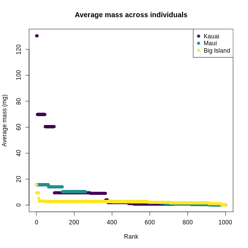

:::::::::::::::::::::::::::::::::::::: questions

-   What information is captured via trait data? 
-   How do you read, clean, and visualize trait data?
-   What do Hill numbers convey in the context of trait data?

::::::::::::::::::::::::::::::::::::::::::::::::

::::::::::::::::::::::::::::::::::::: objectives

After following this episode, participants should be able to...

1.  Import trait data in a CSV format into the R environment
2.  Clean taxonomic names using the `taxize` package
3.  Aggregate traits
4.  Visualize trait distributions
5.  Calculate Hill numbers
6.  Interpret Hill numbers using ranked trait plots

::::::::::::::::::::::::::::::::::::::::::::::::

## Introduction to traits

Trait data is both old and new in ecology.

::: discussion

What have been your experiences with trait data? What are examples of traits you've looked at, or you imagine might be important?

:::


Similarly to abundance, investigating trait data
can give insights into the ecological processes shaping different
communities. Specifically, it would be interesting to answer questions
like: 1) how much does a specific trait vary in a community?; 2) Are all
species converging into a similar trait value or dispersing into a wide
range of values for the trait?; 3) do those patterns of variation change
across different communities? Answering these questions can help us
understand how species are interacting with the environment and/or with
each other.

Defining what exactly constitutes a trait, and measuring traits, can get complicated in ecology. (For example, there are lots of things we can measure about even just a leaf - but it's another story to understand which of those attributes are telling us something _ecologically_ meaningful). Ideally, we'd want to focus on a trait that is easily measurable and also linked to ecological features of interest. One such trait is _body size_. Body size is correlated with a whole host of ecologically meaningful traits, and is one of the easiest things to measure about an organism.

Similarly to how we look at community-wide distributions of abundance, we can generate and interpret community-wide _trait_ distributions. 


And, similar to how we can look at species abundance diversity using Hill numbers, we can look at trait diversity using a _trait_ Hill number.


## Working with trait data

### Importing and cleaning trait data

Here, we will work with a dataset containing values of **body mass** for
the species in the Hawaiian islands. Unlike the abundance data, each
row represents one specimen: in this dataset, each row contains the body
mass measured for that specimen. Our overall goal here is to clean this
data and attach it to the species data, so we can investigate trait
patterns per community.

We're starting with a challenge! First, let's load the packages we'll need for the whole episode (you won't need all of them for this first challenge)


```r
library(taxize)
library(dplyr)
```

```{.output}

Attaching package: 'dplyr'
```

```{.output}
The following objects are masked from 'package:stats':

    filter, lag
```

```{.output}
The following objects are masked from 'package:base':

    intersect, setdiff, setequal, union
```

```r
library(tidyr)
library(hillR)
```


:::::: challenge


In the abundance-data episode, you learned how to read in a `CSV` file
with the `read.csv()` function. In addition, you learned how to clean
and standardize the taxonomic information in your data set using the
`gnr_resolve()` function from the `taxize` package.

You're going to use those skills to import and clean the trait data set.
The trait data set contains two columns: `GenSp`, which contains the
binomial species names, and `mass_g`, which contains the individual's
mass in grams, the metric of body size chosen for the study. The data
also contain typos and a problem with the taxonomy that you must correct
and investigate. Make sure to glance at the data before cleaning!

Your trait data is located at: <https://raw.githubusercontent.com/role-model/multidim-biodiv-data/main/episodes/data/body_size_data.csv>

:::

::: solution

Read in the traits data using the `read.csv` function and supplying it
with the path to the data.


```r
traits <- read.csv('https://raw.githubusercontent.com/role-model/multidim-biodiv-data/main/episodes/data/body_size_data.csv')

head(traits)
```

```{.output}
         GenSp   mass_g
1 Cis signatus 2.499395
2 Cis signatus 2.544560
3 Cis signatus 3.045801
4 Cis signatus 2.471702
5 Cis signatus 3.427594
6 Cis signatus 2.520676
```

Check the names of the traits using the `gnr_resolve()` function. To
streamline your efforts, supply only the unique species names in your
data to `gnr_resolve()`.


```r
# only need to check the unique names
species_list <- unique(traits$GenSp)

name_resolve <- gnr_resolve(species_list, best_match_only = TRUE, 
                            canonical = TRUE)

head(name_resolve)
```

```{.output}
# A tibble: 6 × 5
  user_supplied_name   submitted_name      data_source_title score matched_name2
  <chr>                <chr>               <chr>             <dbl> <chr>        
1 Cis signatus         Cis signatus        Encyclopedia of … 0.988 Cis signatus 
2 Acanthia procellaris Acanthia procellar… uBio NameBank     0.988 Acanthia pro…
3 Spolas solitaria     Spolas solitaria    Encyclopedia of … 0.988 Spolas solit…
4 Spolas solitari      Spolas solitari     Catalogue of Lif… 0.75  Spolas solit…
5 Laupala pruna        Laupala pruna       National Center … 0.988 Laupala pruna
6 Toxeuma hawaiiensis  Toxeuma hawaiiensis Encyclopedia of … 0.988 Toxeuma hawa…
```

To quickly see which taxa are in conflict with `taxize`'s, use bracket
subsetting and Boolean matching.


```r
mismatches_traits <- 
    name_resolve[name_resolve$user_supplied_name != name_resolve$matched_name2, 
                 c("user_supplied_name", "matched_name2")]

mismatches_traits
```

```{.output}
# A tibble: 10 × 2
   user_supplied_name      matched_name2           
   <chr>                   <chr>                   
 1 Spolas solitari         Spolas solitaria        
 2 Metrothorax deverilli   Metrothorax             
 3 Drosophila obscuricorni Drosophila obscuricornis
 4 Cis bimaculatu          Cis bimaculatus         
 5 Agrotis chersotoides    Agrotis                 
 6 Eurynogaster vittat     Eurynogaster vittata    
 7 Atelothrus depressu     Atelothrus depressus    
 8 Hylaeus sphecodoide     Hylaeus sphecodoides    
 9 Hyposmocoma sagittat    Hyposmocoma sagittata   
10 Campsicnemus nigricolli Campsicnemus nigricollis
```

Fixing the names comes in two steps. First, we join the `traits`
dataframe with the `name_resolve` dataframe using the `left_join()`
function. Note, we indicate that the `GenSp` and `user_supplied_name`
columns have the same information by supplying a named vector to the
`by =` argument.


```r
traits <- left_join(traits, 
                    name_resolve[, c("user_supplied_name", "matched_name2")], 
                    by = c("GenSp" = "user_supplied_name"))

head(traits)
```

```{.output}
         GenSp   mass_g matched_name2
1 Cis signatus 2.499395  Cis signatus
2 Cis signatus 2.544560  Cis signatus
3 Cis signatus 3.045801  Cis signatus
4 Cis signatus 2.471702  Cis signatus
5 Cis signatus 3.427594  Cis signatus
6 Cis signatus 2.520676  Cis signatus
```

Then, to fix *Agrotis chersotoides* and *Metrothorax deverilli*, as in abundance-data episode, use bracketed indexing, boolean matching, and assignment.

In addition, although not necessary, changing the column name `matched_name2` to `final_name` to give it a more sensible name for later use is good practice.


```r
traits$matched_name2[traits$matched_name2 == "Agrotis"] <- 
    "Peridroma chersotoides"

traits$matched_name2[traits$matched_name2 == "Metrothorax"] <- 
    "Metrothorax deverilli"

colnames(traits)[colnames(traits) == "matched_name2"] <- "final_name"

head(traits)
```

```{.output}
         GenSp   mass_g   final_name
1 Cis signatus 2.499395 Cis signatus
2 Cis signatus 2.544560 Cis signatus
3 Cis signatus 3.045801 Cis signatus
4 Cis signatus 2.471702 Cis signatus
5 Cis signatus 3.427594 Cis signatus
6 Cis signatus 2.520676 Cis signatus
```

:::

### Summarizing and cleaning trait data

When analyzing trait data, it often needs to be summarized at a higher level than the individual. For instance, many community assembly analyses require species-level summaries, rather than individual
measurements. So, we often want to calculate summary statistics of
traits for each species. For numeric measurements, body size, statistics
like the mean, median, and standard deviation give information about the
center and spread of the distribution of traits for the species. For
this section, you will aggregate the trait data to the species level,
calculating the mean, median, and mode of body size for each species.

While there are methods to aggregate data in base R, the
[dplyr](https://dplyr.tidyverse.org/) makes this task and other data
wrangling tasks much more intuitive. The function `group_by()` groups
your data frame by a variable. The first argument to `group_by()` is
your data frame, and all following unnamed arguments are the variables
you want to group the data by. In our case, we want to group by species
name, so we'll supply `final_name`.


```r
library(dplyr)

# group the data frame by species
traits_sumstats <- group_by(traits, final_name)
```

`group_by()` just adds an index that tells any following `dplyr`
functions to perform their calculations on the group the data frame was
indexed by. So, to perform the actual calculations, we will use the
`summarize()` function (`summarise()` works too for non-Americans). The
first argument you supply is the data frame, following by the
calculations you want to perform on the grouped data and what you want
to name the resulting variables. The structure is
`new_var_name = function(original_var_name)` for each calculation. Here,
we're using the `mean()`, `median()`, and `sd()` functions. Then, we'll
take a look at the new data set with the `head()` function.


```r
# summarize the grouped data frame, so you're calculating the summary statistics for each species
traits_sumstats <-
    summarize(
        traits_sumstats,
        mean_mass_g = mean(mass_g),
        median_mass_g = median(mass_g),
        sd_mass_g = sd(mass_g)
    )

head(traits_sumstats)
```

```{.output}
# A tibble: 6 × 4
  final_name               mean_mass_g median_mass_g sd_mass_g
  <chr>                          <dbl>         <dbl>     <dbl>
1 Acanthia procellaris           1.09          1.13     0.241 
2 Agonismus argentiferus         5.31          5.55     0.992 
3 Atelothrus depressus           0.529         0.521    0.127 
4 Campsicnemus nigricollis       0.422         0.375    0.0992
5 Chrysotus parthenus            1.77          1.70     0.273 
6 Cis bimaculatus                2.31          2.27     0.605 
```

Finally, you need to add the aggregated species-level information back
to the abundance data, so you have the summary statistics for each
species at each site.

First, re-read in the abundance data you used in the abundance
episode.


```r
abundances <- read.csv("https://raw.githubusercontent.com/role-model/multidim-biodiv-data/main/episodes/data/abundances_resolved.csv")

head(abundances)
```

```{.output}
     island  site                GenSp abundance       submitted_name
1 BigIsland BI_01         Cis signatus       541         Cis signatus
2 BigIsland BI_01 Acanthia procellaris        64 Acanthia procellaris
3 BigIsland BI_01     Spoles solitaria        34     Spoles solitaria
4 BigIsland BI_01        Laupala pruna        21        Laupala pruna
5 BigIsland BI_01  Toxeuma hawaiiensis       111  Toxeuma hawaiiensis
6 BigIsland BI_01  Chrysotus parthenus       208  Chrysotus parthenus
                              data_source_title score        matched_name2
1                          Encyclopedia of Life 0.988         Cis signatus
2                                 uBio NameBank 0.988 Acanthia procellaris
3                   Catalogue of Life Checklist 0.750     Spolas solitaria
4 National Center for Biotechnology Information 0.988        Laupala pruna
5                          Encyclopedia of Life 0.988  Toxeuma hawaiiensis
6                          Encyclopedia of Life 0.988  Chrysotus parthenus
            final_name
1         Cis signatus
2 Acanthia procellaris
3     Spolas solitaria
4        Laupala pruna
5  Toxeuma hawaiiensis
6  Chrysotus parthenus
```

To join the data, you'll use `left_join()`, which is hopefully getting
familiar to you now!

`abundances` should be on the left side, since we want the
species-information for each species in each community.


```r
traits_sumstats <- left_join(abundances, 
                             traits_sumstats, 
                             by = "final_name")

head(traits_sumstats)
```

```{.output}
     island  site                GenSp abundance       submitted_name
1 BigIsland BI_01         Cis signatus       541         Cis signatus
2 BigIsland BI_01 Acanthia procellaris        64 Acanthia procellaris
3 BigIsland BI_01     Spoles solitaria        34     Spoles solitaria
4 BigIsland BI_01        Laupala pruna        21        Laupala pruna
5 BigIsland BI_01  Toxeuma hawaiiensis       111  Toxeuma hawaiiensis
6 BigIsland BI_01  Chrysotus parthenus       208  Chrysotus parthenus
                              data_source_title score        matched_name2
1                          Encyclopedia of Life 0.988         Cis signatus
2                                 uBio NameBank 0.988 Acanthia procellaris
3                   Catalogue of Life Checklist 0.750     Spolas solitaria
4 National Center for Biotechnology Information 0.988        Laupala pruna
5                          Encyclopedia of Life 0.988  Toxeuma hawaiiensis
6                          Encyclopedia of Life 0.988  Chrysotus parthenus
            final_name mean_mass_g median_mass_g   sd_mass_g
1         Cis signatus  2.75162128    2.53261792 0.395389440
2 Acanthia procellaris  1.09171586    1.13005561 0.241013781
3     Spolas solitaria  3.01819088    3.19822329 0.612003059
4        Laupala pruna  0.05259815    0.05058839 0.009513021
5  Toxeuma hawaiiensis  2.16818518    2.20868688 0.301463517
6  Chrysotus parthenus  1.76717404    1.69687138 0.273022541
```

## Visualizing trait distributions

Histograms and density plots can help give you a quick look at the
distribution of your data. For quality control purposes, they are useful
to see if there are any suspicious values due to human error. Let's
overlay the histogram and density plots to get an idea of what
aggregated (histogram) and smoothed (density) representations of the
data look like.

The first argument to the `hist()` function is your data. `breaks` sets
the number of histogram bars, which can be tuned heuristically to find a
number of bars that best represents the distribution of your data. I
found that `breaks = 40` is a reasonable value. `xlab`, `ylab`, and
`main` are all used to specify labels for the x-axis, y-axis, and title,
respectively. When scaling the plot, sometimes base R plotting functions
aren't as responsive to the data as we like. To fix this, you can use
the `xlim` or `ylim` functions to set the value range of the x-axis and
y-axis, respectively. Here, we set `ylim` to a vector `c(0, 0.11)`,
which specifies the y-axis to range from 0 to 0.11.

If you're used to seeing histograms, the y-axis may look unfamiliar. To
get the two plots to use the same scale, you set `freq = FALSE`, which
converts the histogram counts to a density value. The density scales the
distribution from 0-1, so the bar height (and line height on the density
plot) is a fraction of the total distribution.

Finally, to add the density line to the plot, you calculate the density
of the trait distribution with the `density()` function and wrap it with
the `lines()` function.


```r
hist(
    traits_sumstats$mean_mass_g,
    breaks = 40,
    xlab = "Average mass (g)",
    ylab = "Density",
    main = "All species",
    ylim = c(0,0.18),
    freq = FALSE
)

lines(density(traits_sumstats$mean_mass_g))
```


In addition to quality control, knowing the distribution of trait data
lends itself towards questions of what processes are shaping the
communities under study. Are the traits overdispersed? Underdispersed?
Does the average vary across communities? To get at these questions, you
need to plot each site and compare among sites. To facilitate
comparison, you're going to layer the distributions on top of each other
in a single plot. Histograms get cluttered quickly, so let's use density
plots for this task.

To plot each site, you need a separate dataframe for each site. The
easiest way to do this is with the `split()` function, which takes a
dataframe followed by a variable to split the dataframe by. It then
returns a list of data frames for each element in the variable.

Running `head()` on the list returns a lot of output, so you can use the
`names()` function to make sure the names of the dataframes in your list
are the sites you intended to split by.


```r
# split by site
traits_sumstats_split <- split(traits_sumstats, traits_sumstats$site)

names(traits_sumstats_split)
```

```{.output}
[1] "BI_01" "KA_01" "MA_01"
```

To plot the data, you first need to initialize the plot with the
`plot()` function of a single site's density. Here is also where you add
the plot aesthetics (labels, colors, line characteristics, etc.). You're
labeling the title and axis labels with `main`, `xlab`, and `ylab`. The
`lwd` ("linewidth") function specifies the size of the line, and I found
a value of two is reasonable. You then supply the color of the line
(`col`) with a color name or hex code. I chose a hex representing a
purple color from the
[viridis](https://sjmgarnier.github.io/viridisLite/index.html) color
palette. Finally, you need to specify the x-axis limits and y-axis
limits with `xlim` and `ylim`. While a negative mass doesn't make
biological sense, it is an artifact of the smoothing done by the
`density` function.

To add density lines to the plot, you use the `lines()` function with
the data for the desired site as the first argument. You also need to
specify the line-specific aesthetics for each line, which are the `lwd`
and `col`. I chose the green and yellow colors from the *viridis*
palette, but you can pick whatever your heart desires!

Finally, you need a legend for the plot. Within the `legend()` function,
you specify the position of the legend ("topright"), the legend labels,
the line width, and colors to assign to the labels.


```r
plot(
    density(traits_sumstats_split$KA_01$mean_mass_g),
    main = "Average mass per study site",
    xlab = "Average mass (g)",
    ylab = "Density",
    lwd = 2,
    col = "#440154FF",
    xlim = c(-3, 20),
    ylim = c(0, 0.25)
)

lines(
    density(traits_sumstats_split$MA_01$mean_mass_g),
    lwd = 2,
    col = "#21908CFF"
)

lines(
    density(traits_sumstats_split$BI_01$mean_mass_g),
    lwd = 2,
    col = "#FDE725FF"
)

legend(
    "topright",
    legend = c("Kauai", "Maui", "Big Island"),
    lwd = 2,
    col = c("#440154FF", "#21908CFF", "#FDE725FF")
)
```


It looks like Kauai insects have a smoother distribution of body masses, while Maui and Big Island show more clumped distributions, possibly due to higher immigration on those islands.

# Hill numbers

Hill numbers are a useful and informative summary of trait diversity, in
addition to other biodiversity variables ([Gaggiotti et al.
2018](https://onlinelibrary.wiley.com/doi/10.1111/eva.12593)). They
contain signatures of the processes underlying community assembly. To
calculate Hill numbers for traits, you're going to use the `hill_func()`
function from the `hillR` package. It requires two inputs- the site by
species abundance dataframe and a traits dataframe that has species as
rows and traits as columns.

:::::: challenge

Your first challenge, if you don't have the site by species abundance
dataframe, is to recreate it here. Remember, you'll need to use the
`pivot_wider()` function and the `abundances` data!

:::

:::: solution


```r
abundances_wide <- pivot_wider(
    abundances,
    id_cols = site,
    names_from = final_name,
    values_from = abundance,
    values_fill = 0
)

# tibbles don't like row names
abundances_wide <- as.data.frame(abundances_wide)

row.names(abundances_wide) <- abundances_wide$site

# remove the site column
abundances_wide <- abundances_wide[,-1]
```

:::::::::::::::::


Now, to create the traits dataframe for Hill number calculations purposed, we just need the taxonomic names and trait mean.


```r
traits_simple <- traits_sumstats[, c("final_name", "mean_mass_g")]

head(traits_simple)
```

```{.output}
            final_name mean_mass_g
1         Cis signatus  2.75162128
2 Acanthia procellaris  1.09171586
3     Spolas solitaria  3.01819088
4        Laupala pruna  0.05259815
5  Toxeuma hawaiiensis  2.16818518
6  Chrysotus parthenus  1.76717404
```

Next, you need to filter for unique species in the dataframe.


```r
traits_simple <- unique(traits_simple)

head(traits_simple)
```

```{.output}
            final_name mean_mass_g
1         Cis signatus  2.75162128
2 Acanthia procellaris  1.09171586
3     Spolas solitaria  3.01819088
4        Laupala pruna  0.05259815
5  Toxeuma hawaiiensis  2.16818518
6  Chrysotus parthenus  1.76717404
```

Finally, you need to set the species names to be row names and remove
the `final_name` column. Note, you have to use the `drop = FALSE` argument
because R has the funny behavior that it likes to convert single-column
dataframes into a vector.


```r
row.names(traits_simple) <- traits_simple$final_name

traits_simple <- traits_simple[, -1, drop = FALSE]

head(traits_simple)
```

```{.output}
                     mean_mass_g
Cis signatus          2.75162128
Acanthia procellaris  1.09171586
Spolas solitaria      3.01819088
Laupala pruna         0.05259815
Toxeuma hawaiiensis   2.16818518
Chrysotus parthenus   1.76717404
```

Next, you'll use the `hill_func()` function from the `hillR` package to
calculate Hill numbers 0-2 of body size across sites.


```r
traits_hill_0 <- hill_func(comm = abundances_wide, traits = traits_simple, q = 0)

traits_hill_1 <- hill_func(comm = abundances_wide, traits = traits_simple, q = 1)

traits_hill_2 <- hill_func(comm = abundances_wide, traits = traits_simple, q = 2)
```

The output of `hill_func()` returns quite a few Hill number options,
which are defined in [Chao et al.
2014](https://www.annualreviews.org/doi/abs/10.1146/annurev-ecolsys-120213-091540).
For simplicity's sake, we will look at `D_q`, which from the
documentation is the:

```         
> functional Hill number, the effective number of equally abundant and functionally equally distinct species

```


```r
traits_hill_1
```

```{.output}
          BI_01      MA_01      KA_01
Q     0.7949925   5.049335   14.11121
FDis  0.5983183   4.283883   10.90624
D_q   7.7865058  13.561339   10.07768
MD_q  6.1902140  68.475746  142.20828
FD_q 48.2001378 928.622813 1433.12950
```

To gain an intuition for what this means, let's plot our data. First,
you will wrangle the output into a single dataframe to work with. Since
Hill q = 0 is species richness, let's focus on Hill q = 1 and Hill q =
2.


```r
traits_hill <- data.frame(hill_trait_0 = traits_hill_0[3, ],
                          hill_trait_1 = traits_hill_1[3, ],
                          hill_trait_2 = traits_hill_2[3, ])

# I don't like rownames for plotting, so making the rownames a column
traits_hill <- cbind(site = rownames(traits_hill), traits_hill)

rownames(traits_hill) <- NULL

traits_hill
```

```{.output}
   site hill_trait_0 hill_trait_1 hill_trait_2
1 BI_01     29.03417     7.786506     4.722840
2 MA_01     15.78844    13.561339    12.185382
3 KA_01     20.04110    10.077680     7.094183
```


Let's look at how Hill q = 1 compare across sites.


```r
plot(factor(traits_hill$site, levels = c("KA_01", "MA_01", "BI_01")),
     traits_hill$hill_trait_1, ylab = "Hill q = 1")
```


Hill q = 1 is smallest on the Big Island, largest on Maui, and in the
middle on Kauai. But what does this mean? To gain an intuition for what
a higher or lower trait Hill number means, you will make rank plots of
the trait data, to make a plot analogous to the species abundance
distribution.


```r
# figure out max number of species at a site for axis limit setting below
max_sp <- sapply(traits_sumstats_split, nrow)
max_sp <- max(max_sp)


plot(
    sort(traits_sumstats_split$KA_01$mean_mass_g, decreasing = TRUE),
    main = "Average mass per study site",
    xlab = "Rank",
    ylab = "Average mass (mg)",
    pch = 19,
    col = "#440154FF",
    xlim = c(1, max_sp),
    ylim = c(0, max(traits_simple$mean_mass_g))
)

points(
    sort(traits_sumstats_split$MA_01$mean_mass_g, decreasing = TRUE),
    pch = 19,
    col = "#21908CFF"
)

points(
    sort(traits_sumstats_split$BI_01$mean_mass_g, decreasing = TRUE),
    pch = 19,
    col = "#FDE725FF"
)

legend(
    "topright",
    legend = c("Kauai", "Maui", "Big Island"),
    pch = 19,
    col = c("#440154FF", "#21908CFF", "#FDE725FF")
)
```


You can see clearly that the trait distributions differ across islands, where
Maui has more species than the other islands and a seemingly more
even distribution than Kauai. Kauai seems to have a greater spread of trait values, however, species abundance strongly influences the calculation of a Hill number. To visualize the role of abundance, we can replicate each species mean by the abundance of that species


```r
# replicate abundances
biIndividualsTrt <- rep(traits_sumstats_split$BI_01$mean_mass_g, 
                        traits_sumstats_split$BI_01$abundance)
maIndividualsTrt <- rep(traits_sumstats_split$MA_01$mean_mass_g, 
                        traits_sumstats_split$MA_01$abundance)
kaIndividualsTrt <- rep(traits_sumstats_split$KA_01$mean_mass_g, 
                        traits_sumstats_split$KA_01$abundance)


plot(
    sort(kaIndividualsTrt, decreasing = TRUE),
    main = "Average mass across individuals",
    xlab = "Rank",
    ylab = "Average mass (mg)",
    pch = 19,
    col = "#440154FF",
    ylim = c(0, max(traits_simple$mean_mass_g))
)

points(
    sort(maIndividualsTrt, decreasing = TRUE),
    pch = 19,
    col = "#21908CFF"
)

points(
    sort(biIndividualsTrt, decreasing = TRUE),
    pch = 19,
    col = "#FDE725FF"
)

legend(
    "topright",
    legend = c("Kauai", "Maui", "Big Island"),
    pch = 19,
    col = c("#440154FF", "#21908CFF", "#FDE725FF")
)
```



What we can see from the individuals-level plot is that much of the range of trait values on Kauai are brought by very rare species, these rare species do not contribute substantially to the diversity as expressed by Hill numbers.

<!-- To factor out the influence -->
<!-- of the number of species from the Hill number and get a stronger -->
<!-- indicator of "evenness", you can divide the Hill number by the number of -->
<!-- species, which you will do for Hill q = 1. -->

<!-- ```{r hill-divide} -->
<!-- sp_counts <- -->
<!--     c( -->
<!--         nrow(traits_sumstats_split$HawaiiIsland_01), -->
<!--         nrow(traits_sumstats_split$Kauai_01), -->
<!--         nrow(traits_sumstats_split$Maui_01) -->
<!--     ) -->

<!-- traits_hill$q1 / sp_counts -->
<!-- ``` -->

<!-- Interestingly, we see that Kauai actually has a more even distribution -->
<!-- of trait values than Maui when accounting for species richness! -->

::: discussion

What are some other interpretations from the plots, summary statistics,
and what you know from your work?

:::


::: keypoints

- Traits data contain more information about ecologically significant traits than just species IDs.
- Traits data can be analzyed with Hill numbers and visualized with rank plots similarly to abundance data.

:::
